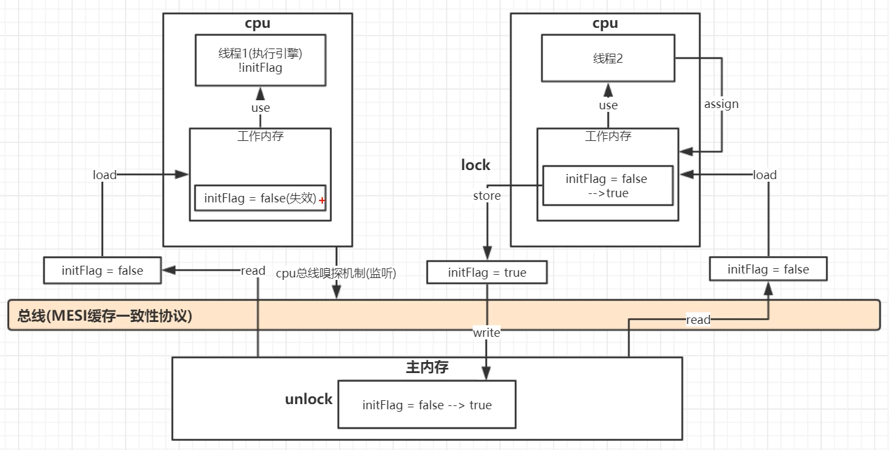
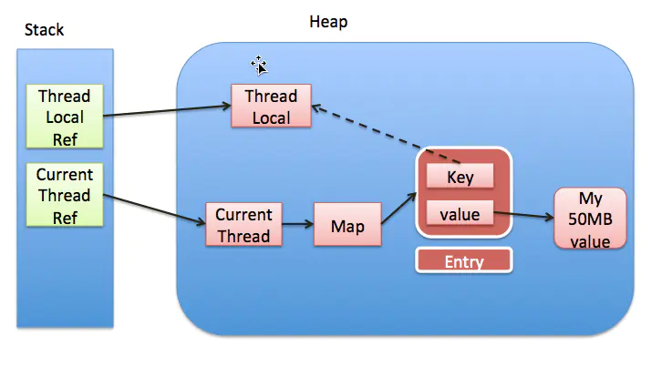

# java高并发编程

[TOC]


## 基本知识

### 线程与进程

#### 线程

线程是程序执行的最小单位，是进程的一个执行流，一个进程可以由多个线程组成，多个线程共享进程的所有资源，每个线程都有独立的堆栈和局部变量。

#### 进程

进程(Process)是程序关于某数据集合上的一次运行活动,是系统进行资源分配和调度的基本单位,是操作系统结构的基础。

#### 线程和进程有什么区别和优劣

1. 进程是资源分配的最小单位，线程是程序执行的最小单位
2. CPU切换或者创建一个线程的开销比进程小很多（因为进程独立分配维护资源，线程共享资源）
3. 线程间通信更加方便（同一进程下的线程共享数据，线程间通信需要以通信的方式IPC进行）
4. 多进程程序更加健壮（一个线程死掉，整个进程就死掉。而进程死掉不会影响其他进程，因为进程有独立的地址空间）

#### java里面如何启动一个线程

1. 继承Thread
2. 实现Runable
3. 实现Callable

### yield

yield的意思是我让出一下CPU，后面你们能不能抢到那我不管

### join

线程ti1里面调用t2.join，表示t2运行完了，t1再接着运行

### 线程的生命周期


### synchronized

#### Synchronized锁的三种使用方式

- 静态方法：类对象
- 非静态方法：调用者对象
- 同步代码块：可配置任意对象，但不建议使用字符串，容易冲突

#### 非静态方法锁的是什么？

调用者对象

#### 静态方法上锁的是什么？

类对象

#### 同步方法执行期间，非同步方法能否执行？为什么？

可以。同步方法执行需要上锁，非同步方法不需要。

#### java中的脏读

对写加锁，但是读没有加锁，导致读出的数据可能出错。

```java
package com.example.mybatis_demo;

import java.util.concurrent.TimeUnit;

public class Main {
    private int i = 0;

    public int getI() {
        return i;
    }

    public synchronized void setI(int i) throws InterruptedException {
        TimeUnit.SECONDS.sleep(1);
        this.i = i;
    }

    public static void main(String[] args) throws InterruptedException {
        Main main = new Main();
        new Thread(() -> {
            try {
                main.setI(100);
            } catch (InterruptedException e) {
                e.printStackTrace();
            }
        }).start();
        System.out.println(main.getI());
        TimeUnit.SECONDS.sleep(2);
        System.out.println(main.getI());
    }
}
```

#### synchronized获得的锁是可重入的

一个同步方法可以调用另外一个同步方法，一个线程已经拥有某一个对象的锁，再次申请的时候仍然可以获取该锁。

- 同一个类中的同步方法互相调用

  ```java
  package com.example.mybatis_demo;
  
  import java.util.concurrent.TimeUnit;
  
  public class Main {
      public synchronized void getI() throws InterruptedException {
          getII();
      }
  
      public synchronized void getII() throws InterruptedException {
          TimeUnit.SECONDS.sleep(3);
          System.out.println("end");
      }
  
      public static void main(String[] args) throws InterruptedException {
          Main main = new Main();
          new Thread(() -> {
              try {
                  main.getI();
              } catch (InterruptedException e) {
                  e.printStackTrace();
              }
          }).start();
      }
  }
  ```

- 子类同步方法调用父类同步方法

  ```java
  package com.example.mybatis_demo;
  
  public class Main {
      public synchronized void get1() {
          System.out.println("父类同步方法");
      }
  
      public static void main(String[] args) {
          new son().get2();
      }
  }
  
  class son extends Main {
      public synchronized void get2() {
          System.out.println("子类同步方法");
          get1();
      }
  }
  ```

#### java中死锁的演示

```java
package com.example.mybatis_demo;

import java.util.concurrent.TimeUnit;

public class Main {
    private static String lockOne = "1";
    private static String lockTwo = "2";

    public static void main(String[] args) {
        new Thread(() -> {
            synchronized (lockOne) {
                try {
                    //让线程2有足够的时间获取锁2
                    TimeUnit.SECONDS.sleep(1);
                } catch (InterruptedException e) {
                    e.printStackTrace();
                }
                synchronized (lockTwo) {
                    System.out.println("thread 1 get locktwo");
                }
            }
        }, "线程1").start();

        new Thread(() -> {
            synchronized (lockTwo) {
                try {
                    //让线程1有足够的时间获取锁1
                    TimeUnit.SECONDS.sleep(1);
                } catch (InterruptedException e) {
                    e.printStackTrace();
                }
                synchronized (lockOne) {
                    System.out.println("thread 2 get lockone");
                }
            }
        }, "线程2").start();
    }
}
```

java中的进程命令查看死锁情况

```java
jps -l
jstack 进程id
```

#### 线程抛出异常时锁会被释放

```java
package com.example.mybatis_demo;

import java.util.concurrent.TimeUnit;

public class Main {
    private int i = 0;

    public synchronized void test() throws InterruptedException {
        while (true) {
            System.out.println(i++);
            TimeUnit.SECONDS.sleep(1);
            if (i == 5) {
                i = i / 0;
            }
        }
    }

    public static void main(String[] args) throws InterruptedException {
        Main main = new Main();
        new Thread(() -> {
            try {
                main.test();
            } catch (InterruptedException e) {
                e.printStackTrace();
            }
        }, "线程1").start();

        //保证线程1获取到main的对象锁
        TimeUnit.SECONDS.sleep(1);

        new Thread(() -> {
            try {
                main.test();
            } catch (InterruptedException e) {
                e.printStackTrace();
            }
        }, "线程2").start();
    }
}
```

#### 锁的对象发生改变，则锁失效

```java
package com.example.mybatis_demo;

import com.example.mybatis_demo.entity.User;

import java.util.concurrent.TimeUnit;

public class Main {
    public User object = new User();

    public void get() throws InterruptedException {
        synchronized (object) {
            while (true) {
                System.out.println(Thread.currentThread().getName());
                TimeUnit.SECONDS.sleep(1);
            }
        }
    }

    public static void main(String[] args) throws InterruptedException {
        Main main = new Main();
        new Thread(() -> {
            try {
                main.get();
            } catch (InterruptedException e) {
                e.printStackTrace();
            }
        },"线程1").start();

        TimeUnit.SECONDS.sleep(5);
        main.object=new User();

        new Thread(() -> {
            try {
                main.get();
            } catch (InterruptedException e) {
                e.printStackTrace();
            }
        },"线程2").start();
    }
}
```

#### 锁对象的属性发生改变不影响锁

```java
package com.example.mybatis_demo;

import com.example.mybatis_demo.entity.User;

import java.util.concurrent.TimeUnit;

public class Main {
    public User object = new User();

    public void get() throws InterruptedException {
        synchronized (object) {
            while (true) {
                System.out.println(Thread.currentThread().getName());
                TimeUnit.SECONDS.sleep(1);
            }
        }
    }

    public static void main(String[] args) throws InterruptedException {
        Main main = new Main();
        new Thread(() -> {
            try {
                main.get();
            } catch (InterruptedException e) {
                e.printStackTrace();
            }
        },"线程1").start();

        TimeUnit.SECONDS.sleep(5);
        main.object.setUserDesc("this is a girl");

        new Thread(() -> {
            try {
                main.get();
            } catch (InterruptedException e) {
                e.printStackTrace();
            }
        },"线程2").start();
    }
}
```

#### 不使用字符串作为锁的对象

String a="abc"; String b="abc";由于锁的对象是存在于堆中，所以a和b是同一个锁。应避免使用字符串锁，防止锁冲突。

#### synchronized锁升级过程

对象包含对象头（markword+类型指针），成员变量数据，对齐部分.

轻量级锁的时候使用自旋，重量级锁的时候使用的是互斥量

##### 示意图


##### 原理

1. 无锁

   锁对象的对象头里面的MarkWord里面存放hashcode,如果不调用则是空的

2. 偏向锁

   一个线程访问。对象头的threadID改成自己的线程id。

3. 轻量级锁

   有锁竞争。采用CAS获得锁，未获得锁的线程自旋等待。

   实现：

   撤销偏向锁

   线程1竞争，在自己的线程栈里面生成自己的一个对象lock-record锁记录。线程2同样如此。两者采用cas方式将自己的锁记录地址修改到markword里面，谁成功谁获取锁，其他线程自旋等待

4. 重量级锁

   自旋等待需要消耗大量的cpu资源，从内核申请重量级锁，只有一个上锁，其他的放在队列里面，不消耗其他的cpu.

   重量级锁从内核态申请，其他锁从用户态申请。从用户态到内核态，再回到用户态消耗很多资源。

##### 锁消除：

没有其他线程和当前线程共享资源，不会发生不一致，则自动消除锁

##### 锁加粗：

反复加锁解锁，则将锁的范围扩大（比如stringBuffer的循环append）

##### 锁降级：

不重要。只会发生在gc时，除了GC线程之外没有其他线程访问他，没有意义。

### volatile

#### 原理

一种稍弱的同步机制，用来确保将变量的更新操作通知到其他线程。当把变量声明为volatile类型后，编译器与运行时都会注意到这个变量是共享的，因此不会将该变量上的操作与其他内存操作一起重排序。volatile变量不会被缓存在寄存器或者对其他处理器不可见的地方，因此在读取volatile类型的变量时总会返回最新写入的值。

当对非 volatile 变量进行读写的时候，每个线程先从内存拷贝变量到CPU缓存中。如果计算机有多个CPU，每个线程可能在不同的CPU上被处理，这意味着每个线程可以拷贝到不同的 CPU cache 中。

而声明变量是 volatile 的，JVM 保证了每次读变量都从内存中读，跳过 CPU cache 这一步。


#### volatile可以保证可见性

```java
//volatile可以保证可见性
package com.example.mybatis_demo;

import java.util.concurrent.TimeUnit;

public class Main {
    public  /*volatile*/ int i = 0;

    public static void main(String[] args) throws InterruptedException {
        Main main = new Main();
        new Thread(() -> {
            System.out.println("start");
            while (main.i == 0) {
            }
            System.out.println("end");
        }, "线程1").start();

        //保证线程1获取到main的对象锁
        TimeUnit.SECONDS.sleep(3);

        main.i = main.i + 1;
    }
}
```

#### 可见性最好加上volatile

```java
package com.example.mybatis_demo;

import java.util.concurrent.TimeUnit;

public class Main {
    //设计到线程之间的可见性最好加上volatile，不加可能会有问题，加上肯定不会有问题。
    private volatile Person person = new Person();

    public static void main(String[] args) {
        Main main = new Main();

        new Thread(() -> {
            try {
                TimeUnit.SECONDS.sleep(2);
            } catch (InterruptedException e) {
                e.printStackTrace();
            }
            System.out.println(main.person.name);
        }, "线程1").start();

        new Thread(() -> {
            try {
                TimeUnit.SECONDS.sleep(1);
            } catch (InterruptedException e) {
                e.printStackTrace();
            }
            main.person.name = "B";
        }, "线程2").start();
    }
}

class Person {
    public String name = "A";
}
```

#### volatile不能保证原子性

可见性与原子性：

主内存有变量i=0;

线程1，2拷贝变量i到自己的工作内存中

线程1修改为1写到主内存时，如果i没有加上volatile，则线程2不会去主内存读取最新的值，这就是线程不可见性。如果加上volatile，则线程2需要用i是会去主内存读取最新的值，这就是保证线程可见性。如果是线程2已经读取过i的值之后，线程1才把值写到主内存，线程2再进行++操作，再写回主内存中就会不能保证原子性了。因为i++操作不是原子性的。

此过程中必须重点关注：

1. 可见性关注的是：开始读
2. 不能保证原子性关注的是：已经读过

```java
//volatile不能保证原子性
//能读取到最新的数据，但是写的时候可能会覆盖原来的数据
package com.example.mybatis_demo;

import java.util.ArrayList;
import java.util.List;

public class Main {
    public volatile int i = 0;

    public void add() {
        for (int j = 0; j < 10000; j++) {
            i++;
        }
    }

    public static void main(String[] args) throws InterruptedException {
        List<Thread> list = new ArrayList<>();
        Main main = new Main();
        for (int i = 0; i < 10; i++) {
            list.add(new Thread(main::add, "线程" + i));
        }
        for (Thread thread : list) {
            thread.start();
        }
        for (Thread thread : list) {
            thread.join();
        }
        System.out.println(main.i);
    }
}
```

#### synchronized既保证了可见性，又保证原子性

```java
//synchronized既保证了可见性，又保证原子性
package com.example.mybatis_demo;

import java.util.ArrayList;
import java.util.List;

public class Main {
    public int i = 0;

    public synchronized void add() {
        for (int j = 0; j < 10000; j++) {
            i++;
        }
    }

    public static void main(String[] args) throws InterruptedException {
        List<Thread> list = new ArrayList<>();
        Main main = new Main();
        for (int i = 0; i < 10; i++) {
            list.add(new Thread(main::add, "线程" + i));
        }
        for (Thread thread : list) {
            thread.start();
        }
        for (Thread thread : list) {
            thread.join();
        }
        System.out.println(main.i);
    }
}
```

#### 使用atomicXXX来保证原子性

```java
//使用atomicXXX来保证原子性
package com.example.mybatis_demo;

import java.util.ArrayList;
import java.util.List;
import java.util.concurrent.atomic.AtomicInteger;

public class Main {
    public AtomicInteger i = new AtomicInteger();

    public void add() {
        for (int j = 0; j < 10000; j++) {
            //替代i++,但是i++不具备原子性，AtomicInteger具备原子性
            i.getAndIncrement();
        }
    }

    public static void main(String[] args) throws InterruptedException {
        List<Thread> list = new ArrayList<>();
        Main main = new Main();
        for (int i = 0; i < 10; i++) {
            list.add(new Thread(main::add, "线程" + i));
        }
        for (Thread thread : list) {
            thread.start();
        }
        for (Thread thread : list) {
            thread.join();
        }
        System.out.println(main.i);
    }
}
```

#### 特点

保证此变量对所有的线程的可见性，这里的“可见性”，如本文开头所述，当一个线程修改了这个变量的值，volatile 保证了新值能立即同步到主内存，以及每次使用前立即从主内存刷新。但普通变量做不到这点，普通变量的值在线程间传递均需要通过主内存（详见：[Java内存模型](http://www.cnblogs.com/zhengbin/p/6407137.html)）来完成

#### synchronized和volatile的区别？

synchronized保证了可见性和一致性，但volatile只保证可见性

在不要求一致性的时候，可以用volatile，其性能比synchronized好很多

volatile不能替代synchronized，因为不具备原子性



## 线程通信

volatile使得线程间具有可见性，也可以作为线程通信的一例。一下除此之外的线程通信举例

### 问题1

设计一个队列，实现10个数字的添加，当size满5时给出提示

#### wait,notify实现

```java
package com.example.mybatis_demo;

import java.util.ArrayList;
import java.util.List;
import java.util.concurrent.TimeUnit;

public class Main {
    private List<Integer> list = new ArrayList<>();

    public void add(Integer integer) {
        list.add(integer);
    }

    public int getSize() {
        return list.size();
    }

    public static void main(String[] args) throws InterruptedException {
        Main main = new Main();
        //锁对象
        Object lock = new Object();

        //线程2先执行等待
        Thread thread2 = new Thread(() -> {
            synchronized (lock) {
                if (main.getSize() != 5) {
                    try {
                        //等待被别人唤醒，释放锁（wait必须先获取锁）
                        lock.wait();
                    } catch (InterruptedException e) {
                        e.printStackTrace();
                    }
                }
                System.out.println("满5个了");
                //需要再次唤醒线程1，继续添加
                lock.notify();
            }
        }, "线程2");

        TimeUnit.SECONDS.sleep(1);

        Thread thread1 = new Thread(() -> {
            synchronized (lock) {
                for (int i = 0; i < 10; i++) {
                    main.add(i);
                    System.out.println("add one");
                    try {
                        TimeUnit.SECONDS.sleep(1);
                    } catch (InterruptedException e) {
                        e.printStackTrace();
                    }
                    if (main.getSize() == 5) {
                        //唤醒线程2
                        lock.notify();
                        try {
                            //线程2被唤醒首先需要获取到锁才能继续执行,所以线程1需要释放锁
                            lock.wait();
                        } catch (InterruptedException e) {
                            e.printStackTrace();
                        }
                    }
                }
            }
        }, "线程1");

        thread1.start();
        thread2.start();
        thread1.join();
        thread2.join();

        System.out.println(main.getSize());
    }
}
```

流程：

- 线程2启动，获得锁，此时size!=5，执行wait释放锁并等待...
- 线程1启动，获得锁，当size=5时，执行notify唤醒线程2，但此时锁还被线程1锁持有，所以线程2需要执行wait释放锁
- 线程2获取锁之后继续执行打印提示语句
- 此时线程1处于等待中，线程2执行提示完毕后需要唤醒线程1，以继续执行添加

注意：

wait释放锁（需要先获取锁，所以wait和notify必须在synhronized方法或者代码块里面使用）

notify和sleep不释放锁

#### countDownLatch门栓

```java
package com.example.mybatis_demo;

import java.util.ArrayList;
import java.util.List;
import java.util.concurrent.CountDownLatch;
import java.util.concurrent.TimeUnit;

public class Main {
    private List<Integer> list = new ArrayList<>();

    public void add(Integer integer) {
        list.add(integer);
    }

    public int getSize() {
        return list.size();
    }

    public static void main(String[] args) throws InterruptedException {
        Main main = new Main();
        //门闩
        CountDownLatch latch = new CountDownLatch(1);

        //线程2先执行等待
        Thread thread2 = new Thread(() -> {
            if (main.getSize() != 5) {
                try {
                    latch.await();
                } catch (InterruptedException e) {
                    e.printStackTrace();
                }
            }
            System.out.println("满5个了");
        }, "线程2");

        TimeUnit.SECONDS.sleep(1);

        Thread thread1 = new Thread(() -> {
            for (int i = 0; i < 10; i++) {
                main.add(i);
                System.out.println("size=" + main.getSize());
                try {
                    TimeUnit.SECONDS.sleep(1);
                } catch (InterruptedException e) {
                    e.printStackTrace();
                }
                if (main.getSize() == 5) {
                    latch.countDown();
                    try {
                        TimeUnit.SECONDS.sleep(1);
                    } catch (InterruptedException e) {
                        e.printStackTrace();
                    }
                }
            }
        }, "线程1");

        thread1.start();
        thread2.start();
        thread1.join();
        thread2.join();

        System.out.println(main.getSize());
    }
}
```

### 问题2

写一个固定容量的同步容器，拥有put和get方法，以及getCount方法，能够支持2个生产者以及10个消费者线程的阻塞调用

#### wait,notify实现

```java
package com.example.mybatis_demo;

import java.util.LinkedList;
import java.util.List;
import java.util.concurrent.TimeUnit;

public class Main {
    private List<Integer> list = new LinkedList<>();
    int count = 10;

    public synchronized void put(Integer a) {
        while (getCount() == count) {
            try {
                this.wait();
            } catch (InterruptedException e) {
                e.printStackTrace();
            }
        }
        list.add(a);
        System.out.println(Thread.currentThread().getName() + "   size:" + getCount());
        this.notifyAll();
    }

    public synchronized void get() {
        while (getCount() == 0) {
            try {
                this.wait();
            } catch (InterruptedException e) {
                e.printStackTrace();
            }
        }
        list.remove(0);
        System.out.println(Thread.currentThread().getName() + "   size=" + getCount());
        this.notifyAll();
    }

    public Integer getCount() {
        return list.size();
    }

    public void customer() {
        for (int i = 0; i < 10; i++) {
            new Thread(() -> {
                while (true) {
                    get();
                }
            }, "消费者" + i).start();
        }
    }

    public void product() {
        for (int i = 0; i < 2; i++) {
            new Thread(() -> {
                while (true) {
                    put(1);
                }
            }, "生产者" + i).start();
        }
    }

    public static void main(String[] args) throws InterruptedException {
        Main main = new Main();
        main.customer();
        TimeUnit.SECONDS.sleep(1);
        main.product();
    }
}
```

##### 为什么是while而不是if

判空或者判满时必须用while，当线程被notify之后，需要再次判断，防止其他线程提前添加元素

##### 为什么时notifyAll而不是notify

假如是需要唤醒生产者，用notify可能唤醒的是消费者

#### lock,condition实现

```java
package com.example.mybatis_demo;

import java.util.LinkedList;
import java.util.List;
import java.util.concurrent.TimeUnit;
import java.util.concurrent.locks.Condition;
import java.util.concurrent.locks.ReentrantLock;

public class Main {
    private List<Integer> list = new LinkedList<>();
    int count = 10;

    private ReentrantLock lock = new ReentrantLock();
    private Condition consumer = lock.newCondition();
    private Condition product = lock.newCondition();

    public void put(Integer a) {
        lock.lock();
        try {
            while (getCount() == count) {
                try {
                    product.await();
                } catch (InterruptedException e) {
                    e.printStackTrace();
                }
            }
            list.add(a);
            System.out.println(Thread.currentThread().getName() + "   size:" + getCount());
            consumer.signalAll();
        } finally {
            lock.unlock();
        }
    }

    public void get() {
        lock.lock();
        try {
            while (getCount() == 0) {
                try {
                    consumer.await();
                } catch (InterruptedException e) {
                    e.printStackTrace();
                }
            }
            list.remove(0);
            System.out.println(Thread.currentThread().getName() + "   size=" + getCount());
            product.signalAll();
        } finally {
            lock.unlock();
        }
    }

    public Integer getCount() {
        return list.size();
    }

    public void customer() {
        for (int i = 0; i < 10; i++) {
            new Thread(() -> {
                while (true) {
                    get();
                }
            }, "消费者" + i).start();
        }
    }

    public void product() {
        for (int i = 0; i < 2; i++) {
            new Thread(() -> {
                while (true) {
                    put(1);
                }
            }, "生产者" + i).start();
        }
    }

    public static void main(String[] args) throws InterruptedException {
        Main main = new Main();
        main.customer();
        TimeUnit.SECONDS.sleep(1);
        main.product();
    }
}
```

##### 和wait,notify相比，lock,contidion有什么优势

可以唤醒指定的某一类线程

#### 使用阻塞队列LinkedBlockingQueue实现

见并发容器栏目

## Reentranlock

https://mp.weixin.qq.com/s?__biz=MzI3NzE0NjcwMg==&mid=2650122072&idx=1&sn=63690ad2cbf2b5390c3d8e1953ffbacf&chksm=f36bba79c41c336fbea8b56289fc2a71e829042f6c3616e3ba051c2542b48f0a3936e3d852f6&mpshare=1&scene=1&srcid=0225xcUOCP6bBS8aCrcd1jBd#rd

可以替代synchronized，也是可重入锁。必须在finally里面手动释放锁。用法如下：

### 一般加锁

```java
package com.example.mybatis_demo;

import java.util.concurrent.TimeUnit;
import java.util.concurrent.locks.ReentrantLock;

public class Main {
    public static void main(String[] args) throws InterruptedException {
        ReentrantLock lock = new ReentrantLock();
        new Thread(() -> {
            try {
                lock.lock();
                //boolean flag=lock.tryLock()
                //boolean flag=lock.tryLock(a,TimeUnit.SECONDS)
                for (int i = 0; i < 10; i++) {
                    System.out.println(i);
                    try {
                        TimeUnit.SECONDS.sleep(1);
                    } catch (InterruptedException e) {
                        e.printStackTrace();
                    }
                }
            } finally {
                lock.unlock();
            }
        }, "线程1").start();

        TimeUnit.SECONDS.sleep(1);

        new Thread(() -> {
            try {
                lock.lock();
                System.out.println("巴拉巴拉");
            } finally {
                lock.unlock();
            }
        }, "线程2").start();
    }
}
```

### 可打断锁

```java
package com.example.mybatis_demo;

import java.util.concurrent.TimeUnit;
import java.util.concurrent.locks.ReentrantLock;

public class Main {
    public static void main(String[] args) throws InterruptedException {
        ReentrantLock lock = new ReentrantLock();
        new Thread(() -> {
            try {
                lock.lock();
                TimeUnit.SECONDS.sleep(Integer.MAX_VALUE);
            } catch (InterruptedException e) {
                e.printStackTrace();
            } finally {
                lock.unlock();
            }
        }, "线程1").start();

        TimeUnit.SECONDS.sleep(1);

        Thread thread = new Thread(() -> {
            try {
                lock.lockInterruptibly();
                System.out.println("线程2执行");
            } catch (InterruptedException e) {
                e.printStackTrace();
            } finally {
                lock.unlock();
            }
        }, "线程2");
        thread.start();

        TimeUnit.SECONDS.sleep(5);
        thread.interrupt();
    }
}
```

### 公平锁

如果不sleep，且线程较多，则不是绝对公平

```java
package com.example.mybatis_demo;

import java.util.concurrent.TimeUnit;
import java.util.concurrent.locks.ReentrantLock;

public class Main {
    public static void main(String[] args) {
        ReentrantLock lock = new ReentrantLock(true);

        for (int i = 0; i < 10; i++) {
            new Thread(() -> {
                for (int j = 0; j < 10; j++) {
                    lock.lock();
                    try {
                        System.out.println(Thread.currentThread().getName());
                        try {
                            TimeUnit.SECONDS.sleep(1);
                        } catch (InterruptedException e) {
                            e.printStackTrace();
                        }
                    } finally {
                        lock.unlock();
                    }
                }
            }, "线程" + i).start();
        }
    }
}
```

### synchronized和reentrantLock的区别

默认都是非公平锁，但是reentrantLock可以指定未公平锁

reentrantLock比synchronized更加灵活，可以尝试上锁，指定锁的时间

reentrantLock可以指定为可打断的锁

## 线程局部变量

volatile是为了实现线程之间的可见性，threadLocal则与之相反

```java
package com.example.mybatis_demo;

import java.util.concurrent.TimeUnit;

public class Main {
    private ThreadLocal<Person> threadLocal = new ThreadLocal<>();

    public static void main(String[] args) {
        Main main = new Main();

        new Thread(() -> {
            try {
                TimeUnit.SECONDS.sleep(2);
            } catch (InterruptedException e) {
                e.printStackTrace();
            }
            System.out.println(main.threadLocal.get());
        }, "线程1").start();

        new Thread(() -> {
            try {
                TimeUnit.SECONDS.sleep(1);
            } catch (InterruptedException e) {
                e.printStackTrace();
            }
            main.threadLocal.set(new Person());
        }, "线程2").start();
    }
}

class Person {
    public String name = "A";
}
```

## 线程安全的单例模式

1. 不使用同步锁

   ```java
   package com.example.mybatis_demo;
   
   public class Main {
       private static Main main=new Main();
   
       private Main() {
       }
   
       public static Main getSingle() {
           return main;
       }
   }
   ```

2. 同步方法

   ```java
   package com.example.mybatis_demo;
   
   public class Main {
       private static Main main;
   
       private Main() {
       }
   
       public static synchronized Main getSingle() {
           if (main == null) {
               main = new Main();
           }
           return main;
       }
   }
   ```

3. 双重同步锁

   ```java
   package com.example.mybatis_demo;
   
   import java.util.concurrent.TimeUnit;
   
   public class Main {
       private static volatile Main main;
   
       private Main() {
       }
   
       public static Main getSingle() {
           if (main == null) {
               //main可能会被多次new出来
               synchronized (Main.class) {
                   try {
                       TimeUnit.MICROSECONDS.sleep(10);
                   } catch (InterruptedException e) {
                       e.printStackTrace();
                   }
                   //所以这里加一次判断就ok了
                   if (main == null) {
                       main = new Main();
                   }
               }
           }
           return main;
       }
   
       //如果在getSingel内部布加上if判断则通过sleep的方式发现会出问题
       public static void main(String[] args) {
           for (int i = 0; i < 100; i++) {
               new Thread(() -> {
                   for (int j = 0; j < 1000; j++) {
                       System.out.println(Main.getSingle().hashCode());
                   }
               }).start();
           }
       }
   }
   ```

4. 内部类

   ```java
   package com.example.mybatis_demo;
   
   public class Main {
       private Main() {
       }
   
       private static class Inner {
           private static Main main = new Main();
       }
   
       public static Main getSingle() {
           return Inner.main;
       }
   }
   ```

## 并发容器

### 并发容器演进

1. 使用非同步容器，出现超卖

   ```java
   package com.example.mybatis_demo;
   
   import java.util.ArrayList;
   import java.util.List;
   import java.util.concurrent.TimeUnit;
   
   public class Main {
       static List<Integer> list = new ArrayList<>();
   
       static {
           for (int i = 0; i < 1000; i++) {
               list.add(i + 1);
           }
       }
   
       public static void main(String[] args) {
           for (int i = 0; i < 10; i++) {
               new Thread(() -> {
                   while (!list.isEmpty()) {
                       try {
                           TimeUnit.MICROSECONDS.sleep(10);
                       } catch (InterruptedException e) {
                           e.printStackTrace();
                       }
                       System.out.println(list.remove(0));
                   }
               }, "线程" + i).start();
           }
       }
   }
   ```

2. 使用同步容器，也超卖

   原因：判断和修改不是原子性的

   ```java
   package com.example.mybatis_demo;
   
   import java.util.Vector;
   import java.util.concurrent.TimeUnit;
   
   public class Main {
       static Vector<Integer> list = new Vector<>();
   
       static {
           for (int i = 0; i < 1000; i++) {
               list.add(i + 1);
           }
       }
   
       public static void main(String[] args) {
           for (int i = 0; i < 10; i++) {
               new Thread(() -> {
                   while (!list.isEmpty()) {
                       try {
                           TimeUnit.MICROSECONDS.sleep(10);
                       } catch (InterruptedException e) {
                           e.printStackTrace();
                       }
                       System.out.println(list.remove(0));
                   }
               }, "线程" + i).start();
           }
       }
   }
   ```

3. 使用synchronized

   ```java
   package com.example.mybatis_demo;
   
   import java.util.ArrayList;
   import java.util.List;
   import java.util.concurrent.TimeUnit;
   
   public class Main {
       static List<Integer> list = new ArrayList<>();
   
       static {
           for (int i = 0; i < 1000; i++) {
               list.add(i + 1);
           }
       }
   
       public static void main(String[] args) {
           for (int i = 0; i < 10; i++) {
               new Thread(() -> {
                   synchronized (list) {
                       while (!list.isEmpty()) {
                           try {
                               TimeUnit.MICROSECONDS.sleep(10);
                           } catch (InterruptedException e) {
                               e.printStackTrace();
                           }
                           System.out.println(list.remove(0));
                       }
                   }
               }, "线程" + i).start();
           }
       }
   }
   ```

4. 并发容器

   ```java
   package com.example.mybatis_demo;
   
   import java.util.ArrayList;
   import java.util.List;
   import java.util.Queue;
   import java.util.concurrent.ConcurrentLinkedQueue;
   import java.util.concurrent.TimeUnit;
   
   public class Main {
       static Queue<Integer> list = new ConcurrentLinkedQueue<>();
   
       static {
           for (int i = 0; i < 1000; i++) {
               list.add(i + 1);
           }
       }
   
       public static void main(String[] args) {
           for (int i = 0; i < 10; i++) {
               new Thread(() -> {
                   while (!list.isEmpty()) {
                       try {
                           TimeUnit.MICROSECONDS.sleep(10);
                       } catch (InterruptedException e) {
                           e.printStackTrace();
                       }
                       Integer integer = list.poll();
                       if (integer == null) {
                           break;
                       }
                       System.out.println(integer);
                   }
               }, "线程" + i).start();
           }
       }
   }
   ```

### 性能测试代码

```java
package com.example.mybatis_demo;

import java.util.Hashtable;
import java.util.Map;
import java.util.Random;
import java.util.concurrent.ConcurrentHashMap;
import java.util.concurrent.CountDownLatch;

public class Main {
    private static Map<String, String> collection = new ConcurrentHashMap<>();
//    private static Map<String, String> collection = new Hashtable<>();
    private static CountDownLatch latch = new CountDownLatch(200);

    public static void main(String[] args) throws InterruptedException {
        long a = System.currentTimeMillis();

        Random random = new Random();
        for (int i = 0; i < 200; i++) {
            new Thread(() -> {
                for (int j = 0; j < 10000; j++) {
                    collection.put(random.nextInt(10000) + "" + random.nextInt(10000), "" + random.nextInt(10000));
                }
                latch.countDown();
            }, "线程" + i).start();
        }
        latch.await();
        System.out.println(collection.size());
        System.out.println("time=" + (System.currentTimeMillis() - a));
    }
}
```

### 并发基础知识

#### 快速失败

在用迭代器遍历一个集合对象时，如果遍历过程中对集合对象的内容进行了修改（增加、删除、修改），则会抛出 Concurrent Modification Exception。

**原理：**迭代器在遍历时直接访问集合中的内容，并且在遍历过程中使用一个 modCount 变量。集合在被遍历期间如果内容发生变化，就会改变 modCount 的值。每当迭代器使用 hashNext()/next() 遍历下一个元素之前，都会检测 modCount 变量是否为 expectedmodCount 值，是的话就返回遍历；否则抛出异常，终止遍历。

**注意：**这里异常的抛出条件是检测到 **modCount != expectedmodCount** 这个条件。如果集合发生变化时修改 modCount 值刚好又设置为了 expectedmodCount 值，则异常不会抛出。因此，不能依赖于这个异常是否抛出而进行并发操作的编程，这个异常只建议用于检测并发修改的 bug。

**场景：**java.util 包下的集合类都是快速失败的，不能在多线程下发生并发修改（迭代过程中被修改）。

#### 安全失败

采用安全失败机制的集合容器，在遍历时不是直接在集合内容上访问的，而是先复制原有集合内容，在拷贝的集合上进行遍历。

**原理：**由于迭代时是对原集合的拷贝进行遍历，所以在遍历过程中对原集合所作的修改并不能被迭代器检测到，所以不会触发 Concurrent Modification Exception。

\>缺点：基于拷贝内容的优点是避免了 Concurrent Modification Exception，但同样地，迭代器并不能访问到修改后的内容，即：迭代器遍历的是开始遍历那一刻拿到的集合拷贝，在遍历期间原集合发生的修改迭代器是不知道的。

**场景：**java.util.concurrent 包下的容器都是安全失败，可以在多线程下并发使用，并发修改。

#### 红黑树

自平衡二叉查找树

#### HashMap

##### 结构图


##### 原理

**HashMap由数组+链表组成**，数组是主体，链表解决了哈希冲突，如果定位到的数组位置不含链表（当前entry的next指向null）,那么查找，添加等操作很快，仅需一次寻址即可；如果定位到的数组包含链表，对于添加操作，其时间复杂度为O(n)，首先遍历链表，存在即覆盖，否则新增；对于查找操作来讲，仍需遍历链表，然后通过key对象的equals方法逐一比对查找。所以，性能考虑，**HashMap中的链表出现越少，性能才会越好。**

###### 如何确定插入位置

index=h&（length-1）保证获取的index一定在数组范围内（h是key的hash值，length是容器的大小），举个例子，默认容量16，length-1=15，h=18,转换成二进制计算为index=2。即位置是2，如果发生hash碰撞则插入到链表头部，否则直接插入。

###### 如何查找元素

计算hash值，index值找到数组位置，通过equals找到具体元素

##### HashMap的数组长度一定是2的次幂

1. 保证得到的新的数组索引和老数组索引一致

   HashMap的数组长度一定保持2的次幂，比如16的二进制表示为 10000，那么length-1就是15，二进制为01111，同理扩容后的数组长度为32，二进制表示为100000，length-1为31，二进制表示为011111。从下图可以我们也能看到这样会保证低位全为1，而扩容后只有一位差异，也就是多出了最左位的1，这样在通过 h&(length-1)的时候，只要h对应的最左边的那一个差异位为0，就能保证得到的新的数组索引和老数组索引一致(大大减少了之前已经散列良好的老数组的数据位置重新调换)，个人理解。

   

2. 使得获得的数组索引index更加均匀

   数组长度保持2的次幂，length-1的低位都为1，会使得获得的数组索引index更加均匀

   

   我们看到，上面的&运算，高位是不会对结果产生影响的（hash函数采用各种位运算可能也是为了使得低位更加散列），我们只关注低位bit，如果低位全部为1，那么对于h低位部分来说，任何一位的变化都会对结果产生影响，也就是说，要得到index=21这个存储位置，h的低位只有这一种组合。这也是数组长度设计为必须为2的次幂的原因。

   

   如果不是2的次幂，也就是低位不是全为1此时，要使得index=21，h的低位部分不再具有唯一性了，哈希冲突的几率会变的更大，同时，index对应的这个bit位无论如何不会等于1了，而对应的那些数组位置也就被白白浪费了。

##### hashmap在jdk1.8中的实现

在jdk1.8中，如果链表长度大于8且节点数组长度大于64的时候，就把链表下所有的节点转为红黑树。

#### hashmap,hashtable,concurrenthashmap的区别与联系

HashTable

- 底层数组+链表实现，无论key还是value都**不能为null**，线程**安全**，实现线程安全的方式是在修改数据时锁住整个HashTable，效率低，ConcurrentHashMap做了相关优化
- 初始size为**11**，扩容：newsize = olesize*2+1
- 计算index的方法：index = (hash & 0x7FFFFFFF) % tab.length

HashMap

- 底层数组+链表实现，可**以存储null键和null值**，线程**不安全**
- 初始size为**16**，扩容：newsize = oldsize*2，size一定为2的n次幂
- 扩容针对整个Map，每次扩容时，原来数组中的元素依次重新计算存放位置，并重新插入
- 插入元素后才判断该不该扩容，有可能无效扩容（插入后如果扩容，如果没有再次插入，就会产生无效扩容）
- 当Map中元素总数超过Entry数组的75%，触发扩容操作，为了减少链表长度，元素分配更均匀
- 计算index方法：index = hash & (tab.length – 1)

ConcurrentHashMap

- 底层采用分段的数组+链表实现，线程**安全**
- 通过把整个Map分为N个Segment，可以提供相同的线程安全，但是效率提升N倍，默认提升16倍。(读操作不加锁，由于HashEntry的value变量是 volatile的，也能保证读取到最新的值。)
- Hashtable的synchronized是针对整张Hash表的，即每次锁住整张表让线程独占，ConcurrentHashMap允许多个修改操作并发进行，其关键在于使用了锁分离技术
- 有些方法需要跨段，比如size()和containsValue()，它们可能需要锁定整个表而而不仅仅是某个段，这需要按顺序锁定所有段，操作完毕后，又按顺序释放所有段的锁
- 扩容：段内扩容（段内元素超过该段对应Entry数组长度的75%触发扩容，不会对整个Map进行扩容），插入前检测需不需要扩容，有效避免无效扩容

### 各种并发容器

#### ConcurrentMap

##### ConcurrentHashMap

- jdk1.8之前的实现

  据结构：数组+链表

  ConcurrentHashMap是由Segment数组结构和HashEntry数组结构组成。Segment是一种可重入锁ReentrantLock，在ConcurrentHashMap里扮演锁的角色，HashEntry则用于存储键值对数据。一个ConcurrentHashMap里包含一个Segment数组，Segment的结构和HashMap类似，是一种数组和链表结构， 一个Segment里包含一个HashEntry数组，每个HashEntry是一个链表结构的元素， 每个Segment守护者一个HashEntry数组里的元素,当对HashEntry数组的数据进行修改时，必须首先获得它对应的Segment锁。

  

- jdk1.8的实现

  数据结构：数组+链表+红黑树

  JDK1.8的实现已经抛弃了Segment分段锁机制，利用CAS+Synchronized来保证并发更新的安全。

  info:cas需要比较更新，而unsafe里面的 比较更新 操作恰为原子操作

##### ConcurrentSkipListMap

（跳表，有序map）

并发情况下，需要排序时用

因为是排号序的，查询比较快


##### 其他相关容器

concurrentHashSet

concurrentSkipListSet

#### CopyOnWriteList

写时复制，写的效率非常低，查询效率非常高

可以用于监听器

#### SynchronizedList

collections.synchronizedXXX();

#### ConcurrentQueue

非阻塞队列

ConcurrentLinkedQueue

add,offer（返回是否添加成功）,pull,peek

#### BlockingQueue

##### LinkedBlockingQueue

阻塞队列【**无界**队列】

put如果满了：阻塞；take如果空了：阻塞

使用阻塞队列实现生产者消费者如下：

```java
package com.example.mybatis_demo;

import java.util.Random;
import java.util.concurrent.LinkedBlockingQueue;
import java.util.concurrent.TimeUnit;

public class Main {

    public static void main(String[] args) {
        LinkedBlockingQueue<Integer> queue = new LinkedBlockingQueue<>();

        new Thread(() -> {
            while (true) {
                try {
                    //如果空了则take阻塞
                    Integer integer = queue.take();
                    System.out.println(Thread.currentThread().getName() + "   " + integer);
                    TimeUnit.SECONDS.sleep(1);
                } catch (InterruptedException e) {
                    e.printStackTrace();
                }
            }
        }, "消费者").start();

        for (int i = 0; i < 5; i++) {
            new Thread(() -> {
                while (true) {
                    try {
                        //如果满了则put阻塞
                        queue.put(new Random().nextInt(100));
                        System.out.println(Thread.currentThread().getName());
                        TimeUnit.SECONDS.sleep(3);
                    } catch (InterruptedException e) {
                        e.printStackTrace();
                    }
                }
            }, "生产者" + (i + 1)).start();
        }
    }
}
```

##### ArrayBlockingQueue

阻塞队列【**有界**队列】

add：队满异常

offer：通过返回值判断是否成功

offer（时间）：一段时间内有没有加成功，这段时间内会阻塞

put：队满阻塞

##### TransferQueue

###### linkedTransferQueue

transfer方法：先寻找有没有消费者，如果有，则直接给消费者，否则会阻塞。如果用add,offer,put则不会阻塞

适合更高并发场景下

##### SynchronusQueue

同步队列：插入元素时必须同时有一个线程往外取。没有容量

```java
package com.example.mybatis_demo;

import java.util.concurrent.*;

public class Main {
    static SynchronousQueue<String> queue = new SynchronousQueue<>();

    public static void main(String[] args) throws InterruptedException {

        Executors.newCachedThreadPool().submit(() -> {
            try {
                System.out.println(queue.take());
            } catch (InterruptedException e) {
                e.printStackTrace();
            }
        });
        queue.put("hello");
        System.out.println("==========");
    }
}
```

#### DelayQueue

存放的元素必须实现Delayed接口

用于执行定时任务

```java
package com.example.mybatis_demo;

import java.util.concurrent.*;

public class Main {

    public static void main(String[] args) throws InterruptedException {
        long now = System.currentTimeMillis();
        DelayQueue<MyDelay> queue = new DelayQueue<>();
        queue.put(new MyDelay(now + 1000));
        queue.put(new MyDelay(now + 5000));
        queue.put(new MyDelay(now + 10000));

        while (!queue.isEmpty()) {
            System.out.println(queue.take());
        }

    }
}

class MyDelay implements Delayed {
    //执行时间
    private long runTime;

    public MyDelay(long runTime) {
        this.runTime = runTime;
    }

    @Override
    public long getDelay(TimeUnit unit) {
        //计算还有多久就要执行了
        return runTime - System.currentTimeMillis();
    }

    @Override
    public int compareTo(Delayed o) {
        /**理解：this为队列中的元素，o为外来元素。越早执行越要放在靠前的位置
         * -1：外来元素0的剩余时间大于this的剩余时间，o需要晚于this执行，不应该让其插入到前面
         * 1 ：外来元素0的剩余时间小于this的剩余时间，o需要早于this执行，应该让其插入到前面
         */
        if (this.getDelay(TimeUnit.MICROSECONDS) < o.getDelay(TimeUnit.MICROSECONDS)) {
            return -1;
        } else if (this.getDelay(TimeUnit.MICROSECONDS) > o.getDelay(TimeUnit.MICROSECONDS)) {
            return 1;
        } else {
            return 0;
        }
    }
}
```

## 队列实战

## 线程池

### Executor接口

void execute(Runable command);

### ExecutorService接口

继承Executor

除了runable(run方法无返回值)，还可以callable(call方法有返回值)

除了execute还可以submit

### Callable

runable(run方法无返回值)，还可以callable(call方法有返回值)

### Executors

操作Executor等类的工具类

### Future

Thread(FutureTask(Callable))

```java
package com.example.mybatis_demo;

import java.util.concurrent.*;

public class Main {
    public static void main(String[] args) throws InterruptedException {
        FutureTask<Integer> futureTask = new FutureTask<>(() -> {
            TimeUnit.SECONDS.sleep(3);
            return 1000;
        });
        new Thread(futureTask).start();
        try {
            System.out.println(futureTask.get());
        } catch (ExecutionException e) {
            e.printStackTrace();
        }
    }
}
```

```java
package com.example.mybatis_demo;

import java.util.concurrent.*;

public class Main {
    public static void main(String[] args) throws InterruptedException, ExecutionException {
        ExecutorService service=Executors.newFixedThreadPool(5);
        Future<Integer> future=service.submit(()->{
            try {
                TimeUnit.SECONDS.sleep(5);
            } catch (InterruptedException e) {
                e.printStackTrace();
            }
            return 1000;
        });
        System.out.println(future.get());
        System.out.println(future.isDone());
    }
}
```

### 并行计算

```java
package com.example.mybatis_demo;

import java.util.ArrayList;
import java.util.List;
import java.util.concurrent.*;

public class Main {
    public static void main(String[] args) throws InterruptedException, ExecutionException {
        //直接计算1到280000之间的素数
        int max = 280000;
        long a = System.currentTimeMillis();
        List<Integer> list0 = getAllPrime(1, max);
        System.out.println(list0.toString());
        long b = System.currentTimeMillis();
        System.out.println(b - a);

        //使用线程池并行计算1到280000的素数
        ExecutorService service = Executors.newFixedThreadPool(5);
        List<Integer> list = new ArrayList<>();
        Future<List<Integer>> future1 = service.submit(() -> {
            return getAllPrime(1, 70000);
        });
        Future<List<Integer>> future2 = service.submit(() -> {
            return getAllPrime(70000, 140000);
        });
        Future<List<Integer>> future3 = service.submit(() -> {
            return getAllPrime(140000, 21000);
        });
        Future<List<Integer>> future4 = service.submit(() -> {
            return getAllPrime(21000, 28000);
        });
        list.addAll(future1.get());
        list.addAll(future2.get());
        list.addAll(future3.get());
        list.addAll(future4.get());
        System.out.println(list.toString());
        System.out.println(System.currentTimeMillis() - b);
    }

    //查找区间内的素数有哪些
    public static List<Integer> getAllPrime(Integer begin, Integer end) {
        List<Integer> list = new ArrayList<>();
        for (int i = begin; i < end; i++) {
            if (isPrime(i)) {
                list.add(i);
            }
        }
        return list;
    }

    //判断一个数是否是素数
    public static boolean isPrime(Integer num) {
        for (int i = 2; i < num / 2; i++) {
            if (num % i == 0) {
                return false;
            }
        }
        return true;
    }
}
```

### POOL

```java
ExecutorService service=Executors.newFixedThreadPool(5);
ExecutorService service=Executors.newCachedThreadPool();
ExecutorService service=Executors.newSingleThreadExecutor();
ExecutorService service=Executors.newScheduledThreadPool(5);
ExecutorService service=Executors.newSingleThreadScheduledExecutor();
ExecutorService service=Executors.newWorkStealingPool(5);

WorkStealingPool线程数量默认为核数：Runtime.getRuntime().availableProcessors()
WorkStealingPool是守护线程，使用ForkJoinPool实现
```

### ThreadPoolExecutor

### ForkJoinPool

```java
package com.example.mybatis_demo;

import java.util.concurrent.ForkJoinPool;
import java.util.concurrent.RecursiveTask;

public class Main {
    //继承RecursiveTask有返回值，如果继承RecursiveAction则没有返回值
    static class FkTask extends RecursiveTask<Integer> {
        private int start;
        private int end;

        public FkTask(int start, int end) {
            this.start = start;
            this.end = end;
        }

        @Override
        protected Integer compute() {
            if (end - start < 1000) {
                int ret = 0;
                for (int i = start; i < end; i++) {
                    ret += i;
                }
                return ret;
            } else {
                FkTask fkTask1 = new FkTask(start, start + (end - start) / 2);
                FkTask fkTask2 = new FkTask(start + (end - start) / 2, end);
                fkTask1.fork();
                fkTask2.fork();
                return fkTask1.join() + fkTask2.join();
            }
        }
    }

    public static void main(String[] args) throws Exception {
        ForkJoinPool forkJoinPool = new ForkJoinPool();
        FkTask fkTask = new FkTask(1, 100000);
        forkJoinPool.execute(fkTask);
        System.out.println(fkTask.join());

        //forkJoinPool的线程是是精灵线程，需要阻塞才能看到结果
        System.in.read();
    }
}
```

### ParallelStreamAPI

多线程的流计算

```java
package com.example.mybatis_demo;

import java.util.ArrayList;
import java.util.List;

public class Main {
    static List<Integer> list = new ArrayList<>();

    static {
        for (int i = 1; i < 100000; i++) {
            list.add(i);
        }
    }

    public static boolean isPrime(Integer num) {
        for (int i = 2; i < num / 2; i++) {
            if (num % i == 0) {
                return false;
            }
        }
        return true;
    }

    public static void main(String[] args) throws Exception {
        long a = System.currentTimeMillis();
        for (Integer integer : list) {
            isPrime(integer);
        }
        long b = System.currentTimeMillis();
        System.out.println(b - a);

        list.parallelStream().forEach(Main::isPrime);
        System.out.println(System.currentTimeMillis() - b);
    }
}
```

## 大厂真题

### synchrnoized和reentranlock的底层实现以及可重入的底层原理？

### 锁的四种状态和升级过程？

本文中搜索“synchronized锁升级过程”

### 线程的生命周期？

本文中搜索“线程的生命周期”

### CAS的ABA问题是如何解决的？

加版本号

### 谈一下AQS,为什么AQS的底层是CAS核volatile？

### 谈一下你对volatile的理解？

### volatile的可见性核禁止指令重排序是如何实现的？

### CAS是什么？

#### 例子

原来的值是0，一个线程将其改为了1，将1写回去之前判断一下原来的值还是不是0，如果是，表明没有被其他线程修改过，可以写回去，否则重新读取，重新操作。

#### 底层实现

cmpxchg: cas修改变量值，compare and exchange

指令**<u>lock cmpxchg</u>**中的lock表示当前cpu执行该指令的时候，不允许其他cpu来打断他

sychoronized和volatile也是用的该指令

### 对象的创建过程?

### 对象在内存的内存布局?

### DCL(双重检查锁)单例为什么要加volatile？

为了防止指令重排序

#### 线程可见性

一个线程改了共享数据，如果加上了volatile则另一个线程会重新从主内存中读取最新的数据。

由于缓存行机制，在缓存行没有对齐的时候，缓存一致性协议可以保证缓存行内数据的一致性，即两个线程的缓存都存在共享数据，其中一个线程改了共享数据，另一个线程会重新读取。如果使用了缓存行对齐，则由于两个线程的缓存行没有共享数据，线程2就不用再次读取住内存的数据了

- 缓存行：对齐伪共享，对齐之后可以加块读写速度。

  读数据：读取一个缓存行=64个字节

  https://www.bilibili.com/video/BV1R7411C7rf?p=4

  缓存行读写效率证明：

  ```java
  package com.example.mybatis_demo;
  
  public class Main {
  
      //一个long 8个字节
      private static class Inner {
          volatile long x = 0;
      }
  
      public static Inner[] num = new Inner[2];
  
      //每个对象8个字节，两个16个字节，小于缓存行字节数64，且两个对象里面的x都是volatile修饰       //的，修改之后需要相互通知，所以效率慢
      static {
          num[0] = new Inner();
          num[1] = new Inner();
      }
  
      public static void main(String[] args) throws Exception {
          long a = System.currentTimeMillis();
          Thread thread1 = new Thread(() -> {
              for (int i = 0; i < 10000000; i++) {
                  num[0].x = i;
              }
          });
          Thread thread2 = new Thread(() -> {
              for (int i = 0; i < 10000000; i++) {
                  num[1].x = i;
              }
          });
          thread1.start();
          thread2.start();
          thread1.join();
          thread2.join();
          System.out.println(System.currentTimeMillis() - a);
      }
  }
  ```

  ```java
  package com.example.mybatis_demo;
  
  public class Main {
      //7个long 加上子类的x恰好64个字节，一个Inner对象刚好占满以后各缓存行
      private static class InnerF {
          volatile long p1, p2, p3, p4, p5, p6, p7;
      }
  
      private static class Inner extends InnerF {
          volatile long x = 0;
      }
  
      public static Inner[] num = new Inner[2];
  
      //两个对象都是64字节大小，所以处于不同的缓存行，两个线程对各自的变量修改不需要通知对方，所以     //效率高一些
      static {
          num[0] = new Inner();
          num[1] = new Inner();
      }
  
      public static void main(String[] args) throws Exception {
          long a = System.currentTimeMillis();
          Thread thread1 = new Thread(() -> {
              for (int i = 0; i < 10000000; i++) {
                  num[0].x = i;
              }
          });
          Thread thread2 = new Thread(() -> {
              for (int i = 0; i < 10000000; i++) {
                  num[1].x = i;
              }
          });
          thread1.start();
          thread2.start();
          thread1.join();
          thread2.join();
          System.out.println(System.currentTimeMillis() - a);
      }
  }
  ```

  框架disruptor缓存行对其代码

  ```java
  public long p1,p2,p3,p4,p5,p6,p7;//缓存行对齐
  private volatile long cursor=INITIAL_CURSOR_VALUE;
  public long p8,p9,p10,p11,p12,p13,p14;//缓存行对齐
  ```

  缓存一致性协议：cpu可以让同一个缓存行内部保持数据一致性

  https://blog.csdn.net/muxiqingyang/article/details/6615199

  X86用的是缓存一致性协议MESI cache:

  状态：modified修改 exclusive独占  shered共享  invalid失效

  其他则不一定是。

  系统底层如何实现数据一致性：

  - MESI如果能解决就用MESI
  - 如果不能，就锁总线


#### 禁止指令重排序

##### 指令重排序演示

cpu执行指令存在指令乱序执行：

```java
package com.example.mybatis_demo;

public class Main {
    static int a, b, x, y;

    public static void main(String[] args) throws Exception {
        int i=0;
        while (true) {
            i++;
            a = 0;b = 0;
            x = 0;y = 0;
            Thread thread1 = new Thread(() -> {
                a = 1;
                x = b;
            });
            Thread thread2 = new Thread(() -> {
                b = 1;
                y = a;
            });
            thread1.start(); thread2.start();
            thread1.join(); thread2.join();
            /**
             * 只会出现这些情况：
             * a b x y
             * 1 1 0 1
             * 1 1 1 0
             * 1 1 1 1
             * 如果出现x=0且y=0则说明cpu指令乱序执行！！！
             */
            if(x==0 && y==0){
                System.out.println("第"+i+"次");
                System.out.println("x="+x+"  y="+y);
            }
        }
    }
}
```

结果：


##### 了解对象的初始化顺序

new Object()时先经历了默认初始化，然后才进行init构造方法。

对象的半初始化状态指只进行了默认初始化，没有进行构造方法初始化。

##### 指令重排序的过程分析

假设线程1获得锁，此时对象没有被创建则去创建对象,new Object（）过程中，字节码

指令：

```java
0 new #2 <T>
4 invokespecial #3 <T.<init>>
7 astore_1
```

本来应该默认初始化之后new之后紧接着进行init构造方法初始化，但是如果指令4和指令7反过来呢，可能就只进行了默认初始化和store操作，此时对戏那个就是非空状态，而此时线程2执行getSingle方法，进行第一个if判断，由于该对象不空（半初始化状态），就直接拿去用了，但实际上该对象的构造方法还没有执行，导致了“脏读”。

##### volatile如何解决指令重排序

1. 代码上写volatile i修饰

2. 字节码标记位ACC_VOLATILE

3. JVM的内存屏障

   什么是屏障：屏障两边不可以重排序，保障有序（jvm有自己的屏障规则，加volatile表示加上了屏障就会阻止指令重排序）java规范有JSR 4种内存屏障；屏障由JVM实现

   volatile在JVM的实现细节：

   - volatile写操作之前加一个StoreStoreBarrier,写操作之后加一个StoreLoadBarrier

   - volatile读操作之前加一个StoreLoadBarrier,写操作之后加一个LoadStoreBarrier

   - 即volatile前后不可以重排序

4. hotspot实现

   cpu层面虽然有内存屏障sfence mfence ifence等系统原语，但是hostpot不是用的这些（因为可移植性差，有的cpu不支持），而是用的lock锁总线

5. 电信号

##### 视频连接

连接：https://www.bilibili.com/video/BV1R7411C7rf?p=6

### Object o=new Object()在内存中占了多少字节？

注意：jvm默认开启字节压缩，所以如果开启压缩则**类型指针**是4个字节，string是4个字节

32位20字节：对象头16个，包含markword的8个和类型指针的8个（没有压缩是8个），加起来16已经是8个倍数，不需要补齐；再加上引用部分o的4个字节，共计20个字节。如果是默认开启压缩，则对象头是8+4=12，不能被8整除，补上4个，是16个，加上引用4个共计20个。

64位24字节：引用是8个字节，比32位多了4个字节

### synchrnoized上锁的过程？

- java代码：synchrnoized
- monitorenter monitorexit
- 执行过程中自动升级
- lock comxchg

注意：

- synchrnoized（o）执行上锁的时候，锁信息放在了该对象的**markword**里面。

- synchrnoized和volatile底层实现依然是指令：cmpxchg

- tip:idea查看字节码插件jclasslib

- JIT(just in time):把热点代码（经常运行的代码）编译成机器语言，下次再使用的时候直接执行，不用再编译

### 你对as-if-serial和happens-before语义的理解？

### 什么是threadlocal,threadlocal中如何解决内存泄露？

### 锁的分类以及jdk中的应用？

### 重写finalize方法导致OOM问题，怎么定位解决？

对象被回收时，finalize方法会被调用

### 强软弱虚引用

强引用：

对象置空之后被回收

软引用SoftReference：

内存够用就不回收，不够就回收

主要用在缓存，如图片缓存，浏览器后退。

弱引用WeakReference：

垃圾回收器发现就回收。



虚引用PhantomReference：

get不到，随时被回收。

用于管理堆外内存

### threadLocal

1. 理解：

   @transaction{

   method1;

   method2;

   }

   方法1和方法2里面都去访问数据库，他们处于同一个线程，所以获得的数据库连接是一个。

2. 源码：

   ```java
   ThreadLocal<User> threadLocal=new ThreadLocal<>();
   threadLocal.set(new User());
   ```

   每个threadlocal都有一个threadLocals的map，set一个user之后将threadlocal对象作为键，user作为值存入map。

   key有一个弱引用指向了threadLocal:

   

   必须要remove(),否则也会产生内存泄露

### LongAdder>AtomicLong>synchronized

LongAdder使用分段锁

### cyclicBarrier

### Phaser

### ReadWriteLock

### 分布式锁redis,zookeeper

### Semaphore

### AQS源码解析 

reentrantlock、

CountDownLatch、CyclicBarrier、Phaser、ReadWriteLock、Semaphore还有后面要讲的Exchanger

都是用同一个队列，同一个类来实现的，这个类叫AQS

### Exchanger


synchronized：系统自带、系统自动加锁，自动解锁、不可以出现多个不同的等待队列、默认进行

四种锁状态的升级

ReentrantLock：需要手动枷锁，手动解锁、可以出现多个不同的等待队列、CIS的实现

### LockSupport

### 淘宝面试题


**缓存一致性问题**：由于在主内训和cpu之间加了高速缓存，在多线程下可能会出现缓存不一致问题，即多核cpu中，每个核的缓存中，关于同一份数据的缓存的内容可能不一致。**【可见性】**

**处理器优化**：处理器为了能让其内部的运算单元被充分利用，会将输入代码进行乱序执行处理**【原子性】**

**指令重排**：除了处理器会对代码进行优化，很多编译器也会做优化，如JIT（即时编译器Just In Time）会进行指令重排**【有序性】**

**原子性**：在一个操作中cpu不可以在中途暂停然后再调度，既不被中断操作，要不执行完成，要不就不执行。

**可见性**：当多个线程访问同一个变量时，一个线程修改了这个变量的值，其他线程能够立即看得到修改的值。

**有序性**：程序执行的顺序按照代码的先后顺序执行

