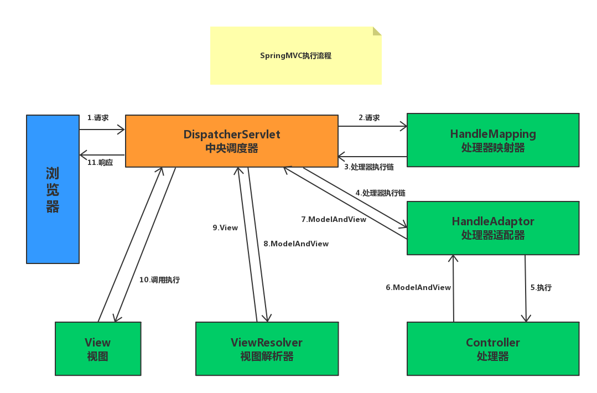

# 基础面试题

## spring是什么?

**spring**是一套致力于**简化**企业应用程序开发的**轻量级容器框架**

## spring的配置方式有哪几种？

1. xml
2. 注解
3. java

## spring有哪些核心模块？

1. spring core：核心类库，提供IOC服务
2. spring context：提供框架式的bean访问服务以及一些企业级功能
3. spring aop：AOP服务
4. spring dao：简化数据访问
5. spring orm：对现有的orm框架的支持
6. spring web：提供基本的web服务
7. spring mvc：提供web应用的model-view-controller实现

## spring有哪些优势和不足？

1. **低侵入**设计，代码污染小
2. **DI**机制将对象之间的依赖关系交由容器管理，**降低**组件的**耦合性**
3. **AOP**技术支持**安全**、**事务**、**日志**、**权限**等任务，从而提供更好的复用
4. spring对于主流应用框架提供了**集成支持**

## spring ioc的理解?

1. 定义

   将创建对象的**控制权转移**到spring容器中，容器根据配置文件创建实例对象以及管理实例之间的依赖关系

2. 优点

   - 对象之间松散耦合，有利于功能复用
   - 让开发更加专注于业务

3. ioc的五种注入方式

   - 构造器注入
   
     ```java
     class TestDemo {
         UserDao userDao;
     
         @Autowired
         public TestDemo(UserDao userDao) {
             this.userDao = userDao;
         }
     }
     ```
   
   - setter注入
   
     ```java
     class TestDemo {
         UserDao userDao;
     
         //或者@Resource
         @Autowired
         public void setUserDao(UserDao userDao) {
             this.userDao = userDao;
         }
     }
     ```
   
   - 字段注入
   
     ```java
     class TestDemo {
         @Autowired
         UserDao userDao;
     }
     ```
   
   - 方法
   
     和set注入类似，方法名字可以不用set字符，autowired,resouce,inject,bean都可以实现方法注入
   
     ```java
     class TestDemo {
         UserDao userDao;
     
         //或者@Resource
         @Autowired
         public void aaa(UserDao userDao) {
             this.userDao = userDao;
         }
     }
     ```
   
   - 接口回调
   
     ```java
     public class Main implements BeanFactoryAware, ApplicationContextAware {
         private BeanFactory beanFactory;
         private ApplicationContext applicationContext;
     
     //    public static void main(String[] s) throws Exception {
     //        AnnotationConfigApplicationContext context = new AnnotationConfigApplicationContext();
     //        context.register(House.class);
     //        context.refresh();
     //        context.close();
     //    }
     
         @Override
         public void setBeanFactory(BeanFactory beanFactory) throws BeansException {
             this.beanFactory = beanFactory;
         }
     
         @Override
         public void setApplicationContext(ApplicationContext applicationContext) throws BeansException {
             this.applicationContext = applicationContext;
         }
     }
     ```

## spring aop的理解？

1. 定义

   一种非侵入式的代码增强技术

2. 原理

   不修改字节码，每次运行时在内存中临时为方法生成一个AOP代理对象，这个AOP代理对象包含了目标对象的全部方法，并且在特定的**切点**做了**增强处理**，并**回调**原对象的方法

3. 优点

   - 减少重复代码
   - 降低耦合度
   - 提高可维护性

4. 应用

   - 事务处理
   - 性能统计
   - 安全控制
   - 异常处理
   - 日志记录
   - 权限认证

5. 拓展

   - AOP代理:
     - 静态代理
       - 代表：AspectJ
       - 特点：AOP会在编译阶段生成AOP代理类，也称为编译时增强，在编译阶段将AspectJ(切面)织入到Java字节码中，运行的时候就是增强之后的AOP对象
     - 静态代理
       - 代表：Spring AOP
       - 两种实现方式：
         - JDK动态代理：只支持实现接口（除public外的其他所有方法，包括public static也不能被增强）
         - CGLIB动态代理：支持实现接口，支持继承类（由于其通过生成目标类子类的方式来增强，因此不能被子类继承的方法都不能被增强，private、static、final 方法）

##  spring aop五种增强类型

1. @Before 前置增强，相当于BeforeAdvice
2. @AfterReturning 后置增强，相当于AfterReturningAdvice
3. @Around 环绕增强，相当于MethodInterceptor
4. @AfterThrowing 抛出增强，相当于ThrowsAdvice
5. @After增强，不管抛出异常还是正常退出，都会执行，没有对应的增强接口，一般用于释放资源

## BeanFactory 与ApplicationContext 是干什么的，两者的区别

BeanFactory、ApplicationContext都代表容器，顶级父类是BeanFactory；BeanFactory是延迟实例化，ApplicationContext默认启动实例化。

BeanFactory是一个基础接口，描述了容器基础的功能，如

- bean定义
- 读取bean
- 管理bean的加载，实例化
- 控制bean的生命周期
- 维护bean的依赖关系

ApplicationContext是容器的高级形态，除了beanFactory的功能外增加了许多了特性，如

- 支持国际化
- 资源文件访问
- 提供监听器中注册bean的时事件
- 同时载入多个配置文件
- 载入多个上下文

## BeanFactory 跟FactoryBean的区别是

FactoryBean ：是一个Bean，可用于生产其他的Bean实例

BeanFactory ：工厂类，用于管理Bean

## Spring IOC容器如何实现

**refresh**方法对容器进行初始化和资源的载入，其中Spring通过定义**BeanDefinition**来管理应用的各种对象及依赖关系，其是容器实现依赖反转功能的核心数据结构，容器解析得到BeanDefinition后，需要在容器中注册，这由IOC实现**BeanDefinitionRegistry**接口来实现，注册过程是IOC容器内部维护了一个**ConcurrentHasmap**来保存得到的BeanDefinition。

## spring bean的生命周期

1. **实例化Bean**

   对于BeanFactory容器，当客户向容器请求一个尚未初始化的bean时，或初始化bean的时候需要注入另一个尚未初始化的依赖时，容器就会调用createBean进行实例化。对于ApplicationContext容器，当容器启动结束后，通过获取BeanDefinition对象中的信息，实例化所有的bean。

2. **设置对象属性**（依赖注入）

   实例化后的对象被封装在BeanWrapper对象中，紧接着，Spring根据BeanDefinition中的信息 以及 通过BeanWrapper提供的设置属性的接口完成依赖注入。

3. **处理Aware接口**

   接着，Spring会检测该对象是否实现了xxxAware接口，并将相关的xxxAware实例注入给Bean：

   ①如果这个Bean已经实现了BeanNameAware接口，会调用它实现的setBeanName(String beanId)方法，此处传递的就是Spring配置文件中Bean的id值；

   ②如果这个Bean已经实现了BeanFactoryAware接口，会调用它实现的setBeanFactory()方法，传递的是Spring工厂自身。

   ③如果这个Bean已经实现了ApplicationContextAware接口，会调用setApplicationContext(ApplicationContext)方法，传入Spring上下文；

4. **BeanPostProcessor**：

   如果想对Bean进行一些自定义的处理，那么可以让Bean实现了BeanPostProcessor接口，那将会调用postProcessBeforeInitialization(Object obj, String s)方法。

5. InitializingBean 与 **init-method**：

   如果Bean在Spring配置文件中配置了 init-method 属性，则会自动调用其配置的初始化方法。

6. 如果这个Bean实现了**BeanPostProcessor**接口，将会调用postProcessAfterInitialization(Object obj, String s)方法；由于这个方法是在Bean初始化结束时调用的，所以可以被应用于内存或缓存技术；

   以上几个步骤完成后，Bean就已经被正确创建了，之后就可以使用这个Bean了。

7. **DisposableBean**

   当Bean不再需要时，会经过清理阶段，如果Bean实现了DisposableBean这个接口，会调用其实现的destroy()方法；

8. **destroy-method**

   最后，如果这个Bean的Spring配置中配置了destroy-method属性，会自动调用其配置的销毁方法。

## spring支持的集中bean作用域

1. singleton：每个容器中只有一个bean的实例
2. prototype：每一个bean请求提供一个实例
3. request：每一个网络请求创建一个实例，请求完后bea会失效并被回收
4. session：每个session中有一个bean实例，过期之后会失效
5. global-session

## singleton bean是否在一个应用中是唯一的？

否。singleton bean在一个spring容器中是唯一的，一个应用可以有多个容器！

## spring中如何处理线程并发问题？

采用ThreadLocal进行处理，解决了线程安全问题

## spring的自动装配

1. 使用@Autowired装配，首先在容器中查询对应类型的bean：

   如果查询结果刚好为一个，就将该bean装配给@Autowired指定的数据；

   如果查询的结果不止一个，那么@Autowired会根据名称来查找；

   如果上述查找的结果为空，那么会抛出异常。解决方法时，使用required=false。

2. 注意：

   @Autowired可用于：构造函数、成员变量、Setter方法

   @Autowired和@Resource之间的区别

    	@Autowired默认是按照**类型**装配注入的，默认情况下它要求依赖对象必须存在（可以设置它		required属性为false）。

   ​	@Resource默认是按照**名称**来装配注入的，只有当找不到与名称匹配的bean才会按照类型来装		配注入

## spring框架中都用到了那些设计模式？

1. 工厂模式：BeanFactory
2. 单例模式：Bean默认单例
3. 模版模式：RestTemplate，JmsTemplate，JpaTemplate
4. 观察者模式：ApplicationLister
5. 代理模式：spring AOP

## spring中有哪些事件？

1. 上下文更新事件（ContextRefreshedEvent）：在调用ConfigurableApplicationContext 接口中的refresh()方法时被触发。
2. 上下文开始事件（ContextStartedEvent）：当容器调用ConfigurableApplicationContext的Start()方法开始/重新开始容器时触发该事件。
3. 上下文停止事件（ContextStoppedEvent）：当容器调用ConfigurableApplicationContext的Stop()方法停止容器时触发该事件。
4. 上下文关闭事件（ContextClosedEvent）：当ApplicationContext被关闭时触发该事件。容器被关闭时，其管理的所有单例Bean都被销毁。
5. 请求处理事件（RequestHandledEvent）：在Web应用中，当一个http请求（request）结束触发该事件。

## spring事务

### spring事务的种类

1. 编程式事务管理使用TransactionTemplate。

2. 声明式事务管理建立在AOP之上的。其本质是通过AOP功能，对方法前后进行拦截，将事务处理的功能编织到拦截的方法中，也就是在目标方法开始之前加入一个事务，在执行完目标方法之后根据执行情况提交或者回滚事务。

3. 两者区别

   声明式事务最大的优点就是不需要在业务逻辑代码中掺杂事务管理的代码，只需在配置文件中做相关的事务规则声明或通过@Transactional注解的方式，便可以将事务规则应用到业务逻辑中。

   声明式事务管理要优于编程式事务管理，这正是spring倡导的非侵入式的开发方式，使业务代码不受污染，只要加上注解就可以获得完全的事务支持。唯一不足地方是，最细粒度只能作用到方法级别，无法做到像编程式事务那样可以作用到代码块级别。

### spring事务的传播行为

1. PROPAGATION_REQUIRED：如果当前没有事务，就创建一个新事务，如果当前存在事务，就加入该事务，该设置是最常用的设置。

2. PROPAGATION_SUPPORTS：支持当前事务，如果当前存在事务，就加入该事务，如果当前不存在事务，就以非事务执行。‘

3. PROPAGATION_MANDATORY：支持当前事务，如果当前存在事务，就加入该事务，如果当前不存在事务，就抛出异常。

4. PROPAGATION_REQUIRES_NEW：创建新事务，无论当前存不存在事务，都创建新事务。

5. PROPAGATION_NOT_SUPPORTED：以非事务方式执行操作，如果当前存在事务，就把当前事务挂起。

6. PROPAGATION_NEVER：以非事务方式执行，如果当前存在事务，则抛出异常。

7. PROPAGATION_NESTED：如果当前存在事务，则在嵌套事务内执行。如果当前没有事务，则按REQUIRED属性执行。

### spring事务的隔离级别

1. ISOLATION_DEFAULT：这是个 PlatfromTransactionManager 默认的隔离级别，使用数据库默认的事务隔离级别。

2. ISOLATION_READ_UNCOMMITTED：读未提交，允许另外一个事务可以看到这个事务未提交的数据。

3. ISOLATION_READ_COMMITTED：读已提交，保证一个事务修改的数据提交后才能被另一事务读取，而且能看到该事务对已有记录的更新。

4. ISOLATION_REPEATABLE_READ：可重复读，保证一个事务修改的数据提交后才能被另一事务读取，但是不能看到该事务对已有记录的更新。

5. ISOLATION_SERIALIZABLE：一个事务在执行的过程中完全看不到其他事务对数据库所做的更新。

# 高级面试题

## Spring DI(依赖注入)的实现

getBean()方法定义在BeanFactory接口中，具体实现在子类AbstractBeanFactory中，过程如下：

1. doGetBean先从缓存中找是否有创建过，没有再从父工厂中去查找
2. 如果父工厂中没有找到，会根据Bean定义来创建Bean，
   1. 单例模式的Bean会先从缓存中查找，确保只创建一次，找到之后返回前将其加到缓存中。
   2. 原型模式的Bean每次都会创建，
   3. 其他模式根据配置的不同生命周期来选择合适的方法创建。
   4. 创建的具体方法通过匿名类中getObject,并委托给createBean来完成bean的实例化。
3. 在createBean中，先对Bean进行一些准备工作，然后会应用配置的前后处理器，如果创建成功就直接返回该代理Bean
4. 没有创建代理Bean的话，会创建指定的Bean实例，委托给doCreateBean完成，该过程会通过提前实例化依赖Bean，并写入缓存来解决Bean的循环依赖
5. 通过populateBean注入Bean属性，并调用init-method初始化方法
6. 注册实例化的Bean

## Spring如何解决循环依赖问题

比如A依赖B, B依赖A.

1. 获取A，singletonObjects、earlySingletonObjects、singletonFactories中都没有，A为null
2. 创建A，先将A对应的ObjectFactory放入缓存singletonFactories中,A依赖B，先获取B
   1. 获取B，singletonObjects、earlySingletonObjects、singletonFactories中都没有，B为null
   2. 创建B，先将B对应的ObjectFactory放入缓存singletonFactories中,B依赖A，先获取A
      1. 获取A，singletonFactories中有A对应的ObjectFactory
      2. 创建A，A=ObjectFactory.getObject()
      3. B完成对A的依赖
   3. B完成创建
3. A完成对B的依赖
4. A完成创建

springbean注册以及依赖文章：https://blog.csdn.net/java_lyvee

## AOP 切点函数

| 类别               | 函数          | 入参           | 说明                                                         |
| ------------------ | ------------- | -------------- | ------------------------------------------------------------ |
| 方法切入点函数     | execution()   | 方法匹配模式串 | 满足某一匹配模式的所有目标类方法连接点。<br/>如execution(* greetTo(..)) 表示所有目标类中的greetTo()方法 |
|                    | @annotation() | 方法注解类名   | 标注了特定注解的目标类方法连接点。<br/>如@annotation(com.smart.anno.NeedTest)表示任何标注了@NeedTest注解的目标类方法 |
| 方法入参切入点函数 | args()        | 类名           | 通过判断目标类方法运行时入参对象的类型定义指定连接点。<br/>如args(com.smart.Waiter)表示所有有且仅有一个按类型匹配于Waiter入参的方法 |
|                    | @args()       | 类型注解类名   | 通过判断目标类方法运行时入参对象的类是否标注特定注解来指定连接点。<br/>如@args(com.smart.Monitorable)表示任何这样的一个目标方法：它有一个入参且`入参对象的类`标注@Monitorable注解 |
| 目标类切点函数     | within()      | 类名匹配串     | 表示特定域下的所有连接点。<br>如within(com.smart.service.\*) 表示com.smart.service 包中的所有连接点，即包中所有类的所有方法；<br>而within(com.smart.service.\*Service)表示在com.smart.service包中所有以Service结尾的类的所有连接点 |
|                    | target()      | 类名           | 假如目标类按类型匹配于指定类，则目标类的所有连接点匹配这个切点<br>如通过target(com.smart.Waiter)，Waiter及Waiter实现类NaiveWaiter中的所有连接点都匹配该切点 |
|                    | @within()     | 类型注解类名   | 假如目标类型按类型匹配于某个类A, 且类A标注了特定注解，则目标类的所有连接点匹配该切点<br>如@within(com.smart.Monitorable) 假如Waiter类标注了@Monitorable注解，则Waiter的所有连接点都匹配该切点，`说是这个注解也会匹配Waiter的子类，但试了后并没有用，Spring 5.1` |
|                    | @target       | 类型注解类名   | 假如目标类标注了特定注解，则目标类的所有连接点都匹配该切点。<br>如@target(com.smart.Monitorable),假如NaiveWaiter标注了@Monitorable,则NaiveWaiter的所有连接点都匹配这个切点 |
| 代理类切点函数     | this()        | 类名           | 代理类按类型匹配于指定类，则被代理的目标类的所有连接点都匹配该切点。<br>如this(com.smart.Seller) 匹配任何运行期对象为Seller类型的类 |


## Spring MVC运行流程



1. 客户端请求到DispatcherServlet
2. DispatcherServlet根据请求地址查询映射处理器HandleMapping，获取Handler
3. 请求HandlerAdatper执行Handler
4. 执行相应的Controller方法，执行完毕返回ModelAndView
5. 通过ViewResolver解析视图，返回View
6. 渲染视图，将Model数据转换为Response响应
7. 将结果返回给客户端

`2，3 两步都在DispatcherServlet -> doDispatch中进行处理`

## Spring MVC 启动流程

1. 在Tomcat启动的时候，ServletContext 会根据web.xml加载ContextLoaderListener，继而通过ContextLoaderListener 载入IOC容器，具体过程有ContextLoader完成，这个IOC容器是在Web环境在使用的WebApplicationContext, 这个容器在后面的DispatcherServlet中作为双亲根上下文来使用
2. IOC容器加载完成后，开始加载DIspatcherServlet，这是Spring MVC的核心，由`HttpServletBean -> initServeltBean`启动（HttpServletBean是DispatcherServlet的父类，HttpServletBean继承了HttpServlet），最终调用`DispatcherServlet -> initStrategies` 方法对HandlerMapping、ViewResolver等进行初始化，至此，DispatcherServelt就初始化完成了，它持有一个第一步完成的上下文作为根上下文，以自己的Servlet名称命名的IOC容器，这个容器是一个WebApplicationContext对象。

## Spring 事务模版

TransactionTemplate 事务模版是对原始事务管理方式的封装，原始事务管理是基于`TransactionDefinition`、`PlatformTransactionManager`、`TransactionStatus` 的编程式事务

事务模版主要通过execute(TransactionCallback<T> action)来执行事务，TransactionCallback 有两种方式一种是有返回值TransactionCallback，一种是没有返回值TransactionCallbackWithoutResult。

## Spring 事务底层原理

1. 事务的准备

   在声明式事务处理中，需要Ioc容器配置TransactionProxyFactoryBean,其父类AbstractSingletonProxyFactoryBean实现了InitializingBeean接口,因此在初始化过程中会调用afterPropertiesSet方法，这个方法实例化了ProxyFactory, 并为其设置了通知，目标对象后，最终返回Proxy代理对象，对象建立起来后，在调用其代理方法的时候，会调用相应的TransactionInterceptor拦截器，在这个调用中，会根据TransactionAttribute配置的事务属性进行配置，为事务处理做好准备

2. 事务拦截器实现

   经过TransactionProxyFactoryBean的AOP包装后，此时如果对目标对象进行方法调用，实际上起作用的是一个Proxy代理对象，拦截器会拦截其中的事务处理，在调用Proxy对象的代理方法时会触发invoke回调,其中会根据事务属性配置决定具体用哪一个PlatformTransactionManager来完成事务操作

## Spring事务失效（事务嵌套), JDK动态代理给Spring事务埋下的坑

https://blog.csdn.net/bntx2jsqfehy7/article/details/79040349

## Spring 单例实现原理

在创建Bean的时候`AbstractAutowireCapableBeanFactory -> doCreateBea0` 通过BeanDefinition 设置的是否单例属性，来判断该bean是否是单例，如果是单例就 根据Bean的名称删除bean缓存中同名称的bean,再在后面重新创建bean.

## 缓存的一些策略有哪几种类型

常见的有FIFO、LRU、LFU、TTL、TTI

FIFO：先进先出策略，先放入缓存的数据先被移除

LRU：最久未使用策略，即使用时间距离现在最久的那个数据被移除

LFU：最近最少使用策略，即一定时间段内使用次数（频率）最少的那个数据被移除

TTL：存活期，即从缓存中创建时间点开始直至到期的一个时间段（不管这个时间段内有没有访问都将过期）

TTI：空闲期，即一个数据多久没被访问就从缓存中移除的时间

## Spring Cache 注解

| 注解         | 用法                                                     |
| ------------ | -------------------------------------------------------- |
| @Cacheable   | 先查询缓存，如果没有则执行方法并缓存结果，用于**取数据** |
| @CachePut    | 先执行方法，然后将返回值放入缓存，用于**更新数据**       |
| @CacheEvict  | 删除缓存，用于**删除数据**                               |
| @Caching     | 基于前3者的注解数组，多用于一个类有多种实现的情况        |
| @CacheConfig | 全局缓存注解，用于类上                                   |

缓存管理器

1. SimpleCacheManager  可以配置缓存列表名称，基本的缓存管理器
2. NoOpCacheManager 不缓存任何数据，用于测试
3. ConcurrentMapCacheManager 不用配置缓存列表，自动生成缓存ConcurrentMapCache
4. CompositeCacheManager 可以将不同的缓存管理器组合在一起，不同的缓存使用不同的缓存管理器，并且可以通过fallbackToNoOpCache属性回到NoOpCacheManager

## Spring  BeanUtils bean拷贝工具用过吗？它是浅拷贝还是深拷贝？怎么实现的？有没有什么坑？其他还有什么bean 拷贝的方法，是浅拷贝还是深拷贝？如何实现深拷贝？

答：浅拷贝！

深度拷贝方法：

1. 将bean转化成json，再将json转化成目标bean
2. 使用流的方法，将源bean转化成流，再从流读取bean

## 依赖查找和依赖注入的区别？

依赖查找：依赖查找方式，需要依赖容器或标砖API实现

依赖注入：依赖绑定方式，无需依赖容器和API

## spring ioc容器启动时做了哪些准备？

1. IOC配置元信息读取和解析
2. IOC生命周期
3. spring事件发布
4. 国际化

## 如何注册一个spring bean?

通过BeanDefinition和外部单体对象类注册

## spring容器怎么管理注册的bean?

1. IOC配置预案信息读取和解析
2. 依赖查找
3. 依赖注入
4. bean的生命周期

## objectFactory和beanFactory的区别？

objectFactory和beanFactory均有依赖查找的能力

objectFactory仅关注一种类型的bean的依赖查找，自身不具备依赖查找能力，能力由beanFactory提供

beanFactory提供单一、集合类型以及多层次的依赖查找方式

## 你偏好构造注入还是set注入？

构造器注入：必须注入

set注入：可选注入

## spring配置元信息具体有哪些？

1. Bean配置元信息：通过xml,properties解析beanDefinition
2. ioc容器配置元信息：通过xml,properties控制ioc行为，如注解驱动、aop
3. 外部化配置：properties,yaml,控制propertySource
4. spring profile：通过外部化配置提供条件分支流程

## BeanPostProcessor使用场景有哪些？

BeanPostProcessor提供spring bean初始化前和初始化后的生命周期回调，分别对应postProcessBeforeInitialization以及postProcessAfterInitialization方法，允许对关系的bean进行扩展甚至替换

+

ApplicationContext相关的Aware回调也是基于BeanPostProcessor实现，即ApplicationContextAwareProcessor

## BeanFactoryPostProcessor和BeanPostProcessor有什么区别？

BeanFactoryPostProcessor时spring beanFactory的后置处理器，或通过BeanFactory进行依赖查找和依赖注入。而BeanPostProcessor则直接与BeanProcessor关联，属于N对1关系。

+

BeanFactoryPostProcessor必须有spring ApplicationContext执行，beanFactory无法直接与其交互

## 注入和查找的依赖来源是否相同？

否。依赖查找的来源仅限与spring beanDefinition以及单例对象，而依赖注入的来源还包括resolvable dependency以及@value所标注的外部化配置

## 单例对象能在IOC容器启动之后注册吗？

可以。单例对象的注册与beanDefinition不通，beanDenifition会被configurableListableBeanFactory#freezeConfiguration方法影响，从而冻结注册，单例对象则没有这个限制。

## spring依赖注入的来源有哪些？

1. spring definition
2. 单例对象
3. resolvable dependency
4. @value外部化配置