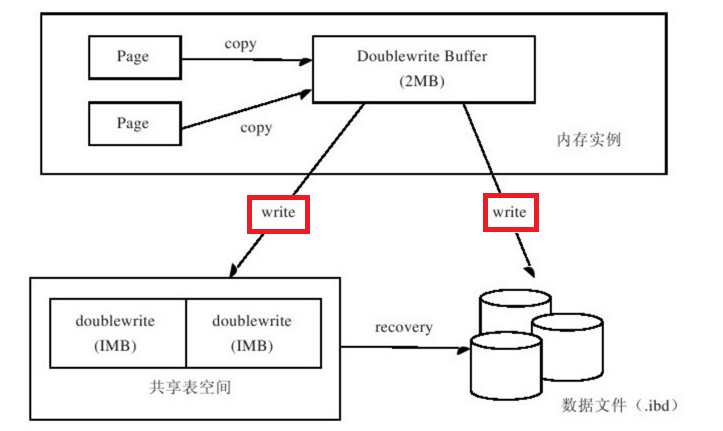
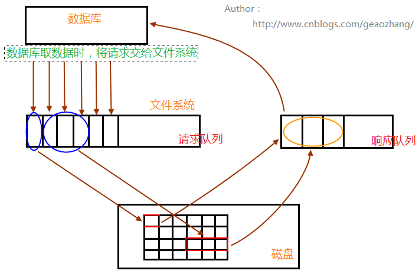
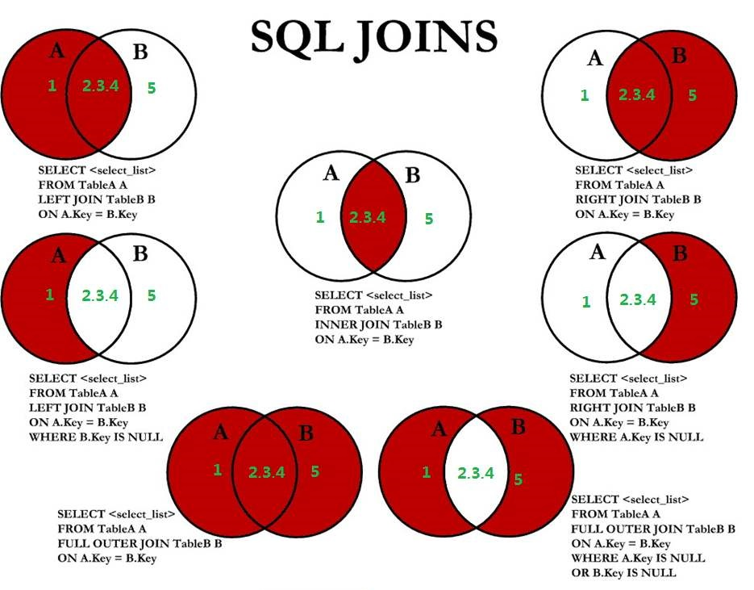
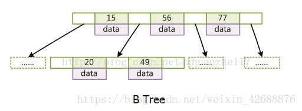
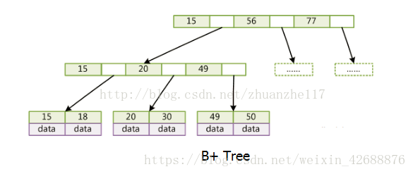
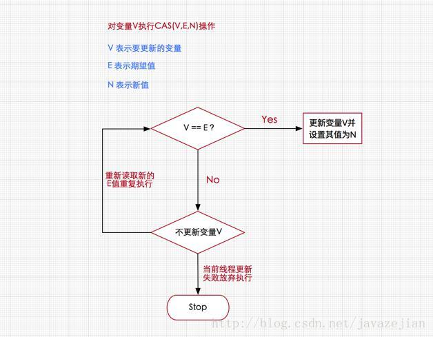
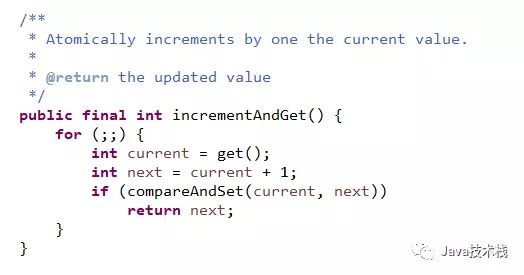
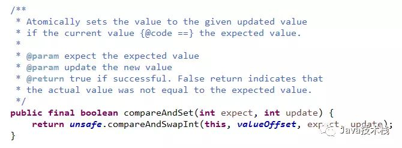
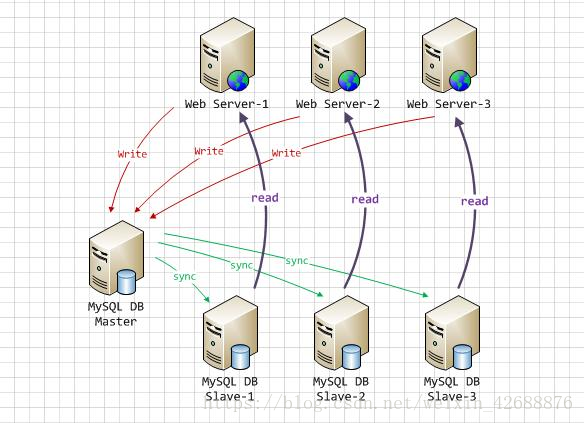
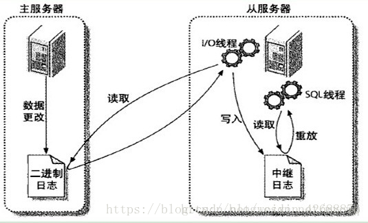

# mysql架构

## 架构图

## 架构层次

1. 连接层
2. 服务层
3. 引擎层
4. 存储层

## 一般交互过程

自然查询语言->解析器->预处理器->查询优化器->数据库引擎->db查询

# 存储引擎

## 自述

数据安全管理和优化的架构

## InnoDB存储引擎的四大特性

### 插入缓冲

> 定义

在**非唯一**的**非聚集索引**中，将多个**索引叶子节点**的插入操作合并为一个插入操作

> 注意

1. id自增的聚集索引中，新增记录的索引叶子节点可以直接插入到尾节点，效率高
2. 非唯一的非聚集索引中，新增数据需要离散地访问非聚集索引页，效率低
3. 必须是辅助索引
4. 必须是非唯一的：辅助索引不能是唯一的，因为在把它插入到插入缓冲时，我们并不去查找索引页的情况。如果去查找肯定又会出现离散读的情况，插入缓冲就失去了意义。
5. 存在问题：宕机时如果有大量的插入缓冲并没有合并到实际的非聚集索引中，恢复合并时间较长

### 二次写

> 背景

如果说插入缓冲带给InnoDB存储引擎的是性能，那么两次写带给InnoDB存储引擎的是数据的可靠性。当数据库宕机时，可能发生数据库正在写一个页面，而这个页只写了一部分（比如16K的页，只写前4K的页）的情况，我们称之为部分写失效（partial page write）。在InnoDB存储引擎未使用double write技术前，曾出现过因为部分写失效而导致数据丢失的情况。

有人也许会想，如果发生写失效，可以通过重做日志进行恢复。这是一个办法。但是必须清楚的是，重做日志中记录的是对页的物理操作，如偏移量800，写'aaaa'记录。如果这个页本身已经损坏，再对其进行重做是没有意义的。这就是说，在应用（apply）重做日志前，我们需要一个页的副本，当写入失效发生时，先通过页的副本来还原该页，再进行重做，这就是doublewrite。

> 二次写

InnoDB存储引擎doublewrite的体系架构如图2-4所示



doublewrite由两部分组成：一部分是内存中的doublewrite buffer，大小为2MB；另一部分是物理磁盘上共享表空间中连续的128个页，即两个区（extent），大小同样为2MB(页的副本)。当缓冲池的**脏页**刷新时，并不直接写磁盘，而是会通过memcpy函数将脏页先拷贝到内存中的**doublewrite buffer**，之后通过doublewrite buffer再分两次，每次写入1MB到共享表空间的物理磁盘上，然后马上调用**fsync**函数，同步磁盘，避免缓冲写带来的问题。在这个过程中，因为doublewrite页是连续的，因此这个过程是顺序写的，开销并不是很大。在完成**doublewrite**页的写入后，再将doublewrite buffer中的页写入各个表空间文件中，此时的写入则是离散的。

如果操作系统在将页写入磁盘的过程中崩溃了，在恢复过程中，InnoDB存储引擎可以从共享表空间中的doublewrite中找到改页的一个副本，将其拷贝到表空间文件，再应用重做日志

### 自适应哈希

> 自适应哈希

InnoDB存储引擎会监控对表上索引的查找，**如果观察到建立哈希索引可以带来速度的提升，则建立哈希索引**，所以称之为自适应（adaptive）的。自适应哈希索引通过缓冲池的B+树构造而来，因此建立的速度很快。而且不需要将整个表都建哈希索引，InnoDB存储引擎会自动根据访问的频率和模式来为某些页建立哈希索引。

根据InnoDB的官方文档显示，启用自适应哈希索引后，读取和写入速度可以提高2倍；对于辅助索引的连接操作，性能可以提高5倍。自适应哈希索引是非常好的优化模式，其设计思想是数据库自优化（self-tuning），即无需DBA对数据库进行调整。

### 预读

InnoDB在I/O的优化上有个比较重要的特性为预读，预读请求是一个i/o请求，它会异步地在缓冲池中预先回迁多个页面，预计很快就会需要这些页面，这些请求在一个范围内引入所有页面。



数据库请求数据的时候，会将**读请求**交给文件系统，放入**请求队列**中；相关进程从请求队列中将读请求取出，根据需求到相关数据区(内存、磁盘)读取数据；取出的数据，放入**响应队列**中，最后数据库就会从响应队列中将数据取走，完成一次数据读操作过程。

　　接着进程继续处理请求队列，(如果数据库是全表扫描的话，数据读请求将会占满请求队列)，判断后面几个数据**读请求的数据是否相邻**，再根据自身系统IO带宽处理量，进行预读，进行**读请求的合并处理**，**一次性读取多块**数据放入响应队列中，再被数据库取走。

​	    预读非为线性预读和随机预读

## InnoDB和MYISAM存储引擎有哪些区别

|          | InnoDB                                       | MYISAM             |
| -------- | -------------------------------------------- | ------------------ |
| 事务     | 支持                                         | 不支持             |
| 主键     | 必须有                                       | 可以没有           |
| 外键     | 支持                                         | 不支持             |
| 存储结构 | 索引数据同一文件                             | 索引数据不同文件   |
| 存储空间 | 占用较多(有专用缓冲池用于高速缓冲数据和索引) | 占用较少(可被压缩) |
| 查询速度 | 相对慢                                       | 相对快             |
| 查询行数 | 慢                                           | 快(有保存总行数)   |
| 锁支持   | 表锁和行锁                                   | 表锁               |
| 死锁     | 容易发生                                     | 不容易发生         |
| 并发性   | 好                                           | 不好               |

## InnoDB和MYISAM的应用场景

1) MyISAM

非事务
大量SELECT查询
2) InnoDB

事务
大量的INSERT或UPDATE操作,高并发

# 数据库基本特性问题

## 三大范式

- 第一范式
- 第二范式
- 第三范式

## 什么是完整性约束

对字段进行约束，从而达到我们期望的效果，比如：默认值、非空、唯一、自增、主键、外键约束

## drop,delete,truncate的区别

drop删除表结构，索引，数据。不记录日志
truncate删除数据，只能删表数据，之后id从1开始。不记录日志
delete删除单行数据。会记录日志

速度：
drop>truncate>delete

## char和varchar的优劣

varchar在存储空间上优于char
char在短数据查询效率上优于varchar

常改字段用varchar
定长字段char可以省去计算长度等工作
短字段用char

## 缓冲池

https://www.yuque.com/yinjianwei/vyrvkf/karbt2

# 事务

## 什么是事务

事务就是一组原子性的操作，这些操作要么全部发生，要么全部不发生

## 四大特性

- 原子性：指的是事务是一个不可分割的操作，要么全都正确执行，要么全都不执行
- 一致性：指的是事务把数据库从一种一致性状态转换成另一种一致性状态，事务开始前和事务结束后，数据库的完整性约束没有被破坏
- 隔离性：每个读写事务相互之间是分开的，在事务提交前对其他事务是不可见的
- 持久性：事务一旦提交，其结果就是永久性的，即使宕机也能恢复

## 事务的实现原理

每提交一个事务必须先将该事务的所有日志写入到**重做日志**文件进行持久化，数据库就可以通过重做日志来保证事务的原子性和持久性。

每当有修改事务时，还会产生undo log，如果需要**回滚**，则根据undo log 的反向语句进行逻辑操作，比如insert 一条记录就delete 一条记录。undo log 主要实现数据库的一致性，还可以用来实现MVCC。

## 使用事务时需要主意哪些东西

不要用自动提交：
默认开启自动提交，应该合并事务，一同提交，减小数据库多次提交导致的开销，大大提高性能。

## 事务的隔离级别

### 未提交读

#### 定义

事务1修改数据未提交，但事务2读取到了该数据

#### 存在脏读

事务A读取了事务B更新的数据，然后B回滚操作，那么A读取到的数据是脏数据

### 提交读

#### 定义

事务1提交修改的内容之后，事务2才能读取该数据

#### 如何解决脏读

事务1先提交，事务2才能读取

#### 存在不可重复读

事务 A 多次读取同一数据，事务 B 在事务A多次读取的过程中，对数据作了更新并提交，导致事务A多次读取同一数据时，结果 不一致

### 可重复读

#### 定义

同一个事务里面多次读取同一个数据（另一个事务将其做了修改），结果是一样的，其他事务做的修改不可见

#### 解决不可重复读

mvcc多版本并发控制：

1. 基本原理

   MVCC的实现，通过保存数据在某个时间点的快照来实现的。这意味着一个事务无论运行多长时间，在同一个事务里能够看到数据一致的视图。根据事务开始的时间不同，同时也意味着在同一个时刻不同事务看到的相同表里的数据可能是不同的。

2. 实现策略

   在每一行数据中额外保存两个隐藏的列：当前行创建时的版本号和删除时的版本号（可能为空，其实还有一列称为回滚指针，用于事务回滚，不在本文范畴）。这里的版本号并不是实际的时间值，而是系统版本号。每开始新的事务，系统版本号都会自动递增。事务开始时刻的系统版本号会作为事务的版本号，用来和查询每行记录的版本号进行比较。

   每个事务又有自己的版本号，这样事务内执行CRUD操作时，就通过版本号的比较来达到数据版本控制的目的。

3. MVCC下InnoDB的增删查改是怎么work的

   - 插入数据（insert）:记录的版本号即当前事务的版本号

     执行一条数据语句：insert into testmvcc values(1,"test");

     假设事务id为1，那么插入后的数据行如下：

     | id   | name | create version | delete version |
     | ---- | ---- | -------------- | -------------- |
     | 1    | test | 1              |                |

   - 在更新操作的时候，采用的是先标记旧的那行记录为已删除，并且删除版本号是事务版本号，然后插入一行新的记录的方式。

     比如，针对上面那行记录，事务Id为2 要把name字段更新

     update table set name= 'new_value' where id=1;

     | id   | name      | create version | delete version |
     | ---- | --------- | -------------- | -------------- |
     | 1    | test      | 1              | 2              |
     | 2    | new_value | 2              |                |

   - 删除操作的时候，就把事务版本号作为删除版本号。比如

     delete from table where id=1;

     | id   | name      | create version | delete version |
     | ---- | --------- | -------------- | -------------- |
     | 1    | new_value | 2              | 3              |

   - 查询操作

     从上面的描述可以看到，在查询时要符合以下两个条件的记录才能被事务查询出来：

     1) 删除版本号未指定或者大于当前事务版本号，即查询事务开启后确保读取的行未被删除。(即上述事务id为2的事务查询时，依然能读取到事务id为3所删除的数据行)

     2) 创建版本号 小于或者等于 当前事务版本号 ，就是说记录创建是在当前事务中（等于的情况）或者在当前事务启动之前的其他事物进行的insert。  

     （即事务id为2的事务只能读取到create version<=2的已提交的事务的数据集）

4. 补充

   1.MVCC手段只适用于Msyql隔离级别中的读已提交（Read committed）和可重复读（Repeatable Read）.

   2.Read uncimmitted由于存在脏读，即能读到未提交事务的数据行，所以不适用MVCC.

   原因是MVCC的创建版本和删除版本只要在事务提交后才会产生。

   3.串行化由于是会对所涉及到的表加锁，并非行锁，自然也就不存在行的版本控制问题。

   4.通过以上总结，可知，MVCC主要作用于事务性的，有行锁控制的数据库模型。

5. 关于Mysql中MVCC的总结

   客观上，我们认为他就是乐观锁的一整实现方式，就是每行都有版本号，保存时根据版本号决定是否成功。

   但由于Mysql的写操作会加排他锁（前文有讲），如果锁定了还算不算是MVCC？

   了解乐观锁的小伙伴们，都知道其主要依靠版本控制，即消除锁定，二者相互矛盾，so从某种意义上来说，Mysql的MVCC并非真正的MVCC，他只是借用MVCC的名号实现了读的非阻塞而已。

### 幻读

#### 定义

一个事务，多次查询后，结果集的个数不一致

#### 解决幻读

next-key lock(记录锁和间隙锁)

它是 Record Locks 和 Gap Locks 的结合，不仅锁定一个记录上的索引，也锁定索引之间的间隙。

例如一个索引包含以下值：10, 11, 13, and 20，那么就需要锁定以下区间：
(negative infinity, 10]
(10, 11]
(11, 13]
(13, 20]
(20, positive infinity)

### 可串行读

#### 定义

强制事务串行执行

#### 解决幻读

对所有读取的行都加锁

# SQL

## sql性能下降的原因

1. 查询语句太烂
2. 索引失效
3. 关联查询太多join
4. 服务器调优及各个参数配置不合理
5. 列字段类型设置不合理

## sql执行顺序

1. 手写


select distinct...from...join on...where...group by...having...order by...limit

2. 机读

from...on join...where...group by...having...select...distinct...order by...limit

## join视图



# 索引

## B树和B+树的区别

1、B树，每个节点都存储key和data，所有的节点组成这可树，并且叶子节点指针为null，叶子节点不包含任何关键字信息

2、B+树，所有的叶子节点中包含全部关键字的信息，及指向含有这些关键字记录的指针，且叶子节点本身依关键字的大小自小到大的顺序链接，所有的非终端节点可以看成是索引部分，节点中仅含有其子树根节点中最大（或最小）关键字





## 什么是索引？

索引是帮助数据库快速查找数据的数据结构。

## mysql为什么使用自增列作为主键

如果表使用自增主键，那么每次插入新的记录，记录就会顺序添加到当前索引节点的后续位置

如果使用非自增主键，由于每次插入主键的值近似于随机，因此每次新纪录都要被插到现有索引页得中间某个位置，此时MySQL不得不为了将新记录插到合适位置而移动数据，甚至目标页面可能已经被回写到磁盘上而从缓存中清掉，此时又要从磁盘上读回来，这增加了很多开销，同时频繁的移动、分页操作造成了大量的碎片，得到了不够紧凑的索引结构，后续不得不通过OPTIMIZE TABLE来重建表并优化填充页面。

## 哪些情况需要建立索引？

1. where字段很频繁
2. order by的字段
3. group by的字段，分组必排序
4. 外键关系建立索引

## 哪些情况不适合建立索引？

1. 频繁更新的字段
2. 表记录太少
3. 列数据重复率高

## 前缀索引与索引选择性计算

索引开始的部分字符以节约索引空间，提升索引效率；但也降低了索引选择性

索引选择性=不重复的索引值/数据表的记录总数

索引选择性越高，查询效率越高

blob,text，很长的varchar必须使用前缀索引

演示

```mysql
create table city(name varchar(50) not null);
```

```mysql
select count(*)  cnt,name 
from city group by name
order by cnt desc
limit 10;
```

| cnt  | name           |
| ---- | -------------- |
| 65   | londom         |
| 49   | hiroshima      |
| 48   | teboksary      |
| 47   | pak kret       |
| 47   | yaound         |
| 45   | tel aviv-jaffa |
| 45   | shimoga        |
| 45   | cabuyao        |
| 45   | bislig         |

```mysql
select count(*)  cnt,left(name,3)  pref
from city group by pref
order by cnt desc
limit 10;
```

| cnt  | name |
| ---- | ---- |
| 483  | san  |
| 195  | cha  |
| 177  | tan  |
| 167  | sou  |
| 163  | al-  |
| 146  | shi  |
| 136  | hal  |
| 130  | val  |
| 129  | bat  |

```mysql
select count(*)  cnt,left(name,7)  pref
from city group by pref
order by cnt desc
limit 10;
```

| cnt  | name    |
| ---- | ------- |
| 70   | Santiag |
| 68   | san fel |
| 65   | london  |
| 61   | valle d |
| 48   | hiroshi |
| 48   | teboksa |
| 48   | pak kre |
| 47   | yaound  |
| 47   | yel avi |

发现以前7位字符串作为前缀比较合适。

计算索引选择性：

```mysql
select count(distinct name)/couont(*) from city;
select count(distinct left(name,3))/couont(*) from city;
select count(distinct left(name,7))/couont(*) from city;
```

添加前缀索引：

```mysql
alter table city add key (name(7))
```

前缀索引使索引更小更快

但是无法使用前缀索引做order by,group by,覆盖扫描

## 执行计划

1. 查询序号id：相同从上往下执行，否则先大后小

2. 查询类型select_type:
   - simple
   - primary
   - subquery
   - derived
   - union
   - union result
   
3. type:从上到下性能降低
   - system
   - const
   - ref_eq
   - **ref**
   - **range**
   - index
   - all
   
4. possile_keys

5. key_len

   key_len的算法：

   参数：

   - 数据类型：varchar->+2   char->+0

   - 字符集：utf-8->3个字节   
   - 是否为空：null->+1   not null->+0
   - 本身的长度：varchar(?)

   例如varchar(50):50*3+2+0=152

   作用：判断符合索引是否被充分使用

6. ref

7. rows

8. extra

## 索引优化

### 查询优化

- 小表驱动大表
- 主查询数据集大用in,否则用exists
- 单表：区间查找时右边失效，可以跳过该字段建立索引
- 双表：左连右建，右连左建
- 三表：a left join on b left join on c,分别在b和c上建立单索引
- 小表驱动大表+左连右建：例如a表数据量小，b表数据量大，则a left join b,b上建立索引，或者b right join a,b上建立索引
- 反范式化优化（允许存在少量冗余，以空间换取时间。范式化要求少冗余）。比如原来通过两个表关联查询，第一个查了3个字段，第二个1个字段，则考虑将这个字段冗余到第一个表中，这样只用查询一个表。

### file sorting

1. 双路排序

   mysql4.1之前，两次扫描磁盘。

   从磁盘去除排序字段，在buffer进行排序，再从磁盘取出其他字段

2. 单路排序

   从磁盘中查询所需的所有列，按照order by列在buffer对其排序

3. 单路排序的利弊

   排序一般较快。但可能取出的数据量超出sort_buffer容量，导致每次只能读取sort_buffer容量大小的数据，进行排序（创建临时文件，多路合并），造成多次i/o

4. 提高order by的速度

   - 禁用select *
   - 尝试提高sort_buffer_size
   - 尝试提高max_length_for_sort_data
   
5. 视频熟悉

   https://developer.aliyun.com/lesson_1762_14733?spm=5176.10731542.0.0.654e6ac877g001#_14733

### 避免索引失效

1. 全值匹配（把建的所有索引都用上）
2. 最佳左前缀
3. 前缀索引（索引选择性计算）
4. 不在索引列上做任何操作（计算、函数、手动或者自动类型转换）
5. 范围索引右边的索引会全失效，**本身有用**，所以范围查询需靠后。右边失效只针对where字段，不针对order by字段。
6. 尽量使用覆盖索引（索引列包含查询列）
7. 不等于会导致索引失效进行全表扫面
8. is null,is not null也无法使用索引（尽量设置默认值）
9. like通配符不要以%开头，否则本身失效（实在要用可以用覆盖索引弥补）
10. 字符串必须加单引号，否则会发生隐式类型转换导致索引失效
11. 少用or，用他来链接会导致两边索引均失效
12. 分页使用延迟关联
13. order by为排序使用索引key a_b_c(a,b,c)
    - order by语句使用索引最左前缀原则
      - order by a
      - order by a,b
      - order by a,b,c
      - order by a desc,b desc,c desc
    - 如果where使用索引的最左前缀定义为常量，则order by能使用索引
      - where a=const order by b,c
      - where a=const and b=const order by c
      - where a=const order b,c
      - where a=const and b>const order by c
    - 不能使用索引进行排序
      - order by a asc,b desc, c desc
      - where g=const order by b,c
      - where a=const order by c
      - where a=const order by a,c
      - where a in(...) order by b,c
14. group by
    - 先排序后分组，遵循最佳左前缀
    - 当无法使用索引列，增大max_length_for_sort_data+sort_buffer_size
    - where高于having,能在where限定的条件不要去having限定

### 查询截取分析

1. 慢查询日志

   - 开启慢查询

     ```mysql
     show variables like 'slow_query_log';
     set global slow_query_log='ON'; 
     set global slow_query_log_file='./data/slow.log';
     set global long_query_time=1;
     ```

   - mysqldumpslow -s t -t 5 pathfile

   - explain+extended

2. 批量数据脚本

   - 存储函数：字符串函数rand_str(int n)

     ```mysql
     DELIMITER $$
     CREATE FUNCTION rand_str(n INT) RETURNS VARCHAR(255)
     BEGIN
     DECLARE chars_str VARCHAR(100) DEFAULT 'abcdefghijklmnopqrstuvwxyzABCDEFGHIJKLMNOPQRSTUVWXYZ';
     DECLARE return_str VARCHAR(255) DEFAULT '';
     DECLARE i INT DEFAULT 0;
     WHILE i<n DO
     SET return_str=CONCAT(return_str,SUBSTRING(chars_str,FLOOR(1+RAND()*52),1));
     SET i      i+1;
     END WHILE;
     RETURN return_str;
     END $$
     ```

   - 存储函数：数字函数rand_num(int m,int n)

     ```mysql
     DELIMITER $$
     CREATE FUNCTION rand_num(m INT,n INT) RETURNS INT(11)
     BEGIN
     DECLARE i INT DEFAULT 0;
     SET i=FLOOR(m+RAND()*(n-m));
     RETURN i;
     END $$
     ```

   - 存储过程：向tb_user表中插入max_num条数据

     ```mysql
     DELIMITER $$
     CREATE PROCEDURE insert_tb_user(IN max_num INT(10))
     -- CREATE PROCEDURE insert_tb_user(IN START INT(10),IN max_num INT(10))
     BEGIN
      DECLARE i INT DEFAULT 0;
     SET autocommit=0;
     REPEAT
     SET i=i+1;
     INSERT INTO tb_user(username,age) VALUES(rand_string(5),rand_num(20,30));
     UNTIL i=max_num
     END REPEAT;
     COMMIT;
     END $$
     ```

     ```mysql
     delimiter ;
     CALL insert_tb_user(50);
     ```

3. show profile

   ```mysql
   show variables like '%profiling%';
   set global profiling = 1;
   show profiles;
   show profile cpu,block io... ... for query n
   ```

   status列如出现以下语句，需要优化

   - converting HEAP to myisam查询结果太大，内存不够用往磁盘上搬了
   - create tmp table创建临时表
   - copying to tmp table on disk把内存中历史表复制到磁盘，危险！
   - locked

4. 全局查询日志

   只允许测试环境使用！

   ```mysql
   show variables like '%general_log%';
   set global general_log=1;
   set global log_output='TABLE';
   select * from mysql.general_log;
   ```

# 数据库锁理论

## 锁的含义

锁是计算机协调多个进程或线程并发访问某一资源的机制

## 分类

按操作分：读锁（共享锁）｜  写锁（排它锁）

按粒度分：表锁（偏读）    ｜  行锁（偏写）

## 行锁与表锁的区别

表锁：开销小、加锁快；无死锁；但锁的范围大，容易发生锁冲突、并发度低

行锁：开销大，加锁慢；容易出现死锁；锁的范围较小，不易发生锁冲突，并发度高

## 表锁

### 表锁特点

```mysql
MYISAM引擎下
show open tables;
lock table teacher read,dev write;
unlock tables;
```

表上读锁：

session1表1上读锁时，

session1:可读本表，不可修改本表，不可读其他表，不可修改其他表

session2:可读本表，阻塞修改本表，可读其他表，可修改其他表

表上写锁：

session1表1上写锁时，

session1:可读本表，可修改本表，不可读其他表，不可修改其他表

session2:阻塞读本表，阻塞修改本表，可读其他表，可修改其他表

总结：

读锁会阻塞写，不会阻塞读

写锁会阻塞读和写

### 如何分析表锁定

```mysql
show status like 'table%';
```

table_locks_immediate:产生表级锁定的次数，表示可以立即获取锁的查询次数，每立即获取锁值加1

table_locks_waited:出现表级锁定争用而发生等待的次数（不能立即获取锁的次数，每等待一次锁值加1），此值高说明存在较严重的表级锁争用情况

## 行锁

InnoDB引擎下

set autocommit=0;

session1做修改，未提交前，自己可查到修改的内容，session2不能。session1提交之后则可以。

session1做修改，未提交前，session2对相同记录做修改，陷入阻塞，但是可以修改其他记录。session1提交之后session2才能进行修改。两者修改的内容在两者都commit之前都不可见，commit之后均可以

### 索引失效，行锁变表锁

本来更改各自的数据记录互不影响。由于varchar类型没有加上''，类型发生隐式转换，导致行锁变表锁

声明：name varchar(25)

session1更新id=1的name=qinmeng,未提交

session2更新id=2的name='huangran',未提交

session2提交出现阻塞

直到session1提交,session2才能更新

### 间隙锁

更新条件有区间，区间内没有的记录也给锁住

### 锁定一行

begin

select * from where a=1 for update

commit;

### 如何分析行锁

show status like 'innodb_row_lock%';

innodb_row_lock_current_waits:当前正在等待的锁定的数量

innodb_row_lock_waits:系统启动到现在总共等待的次数

innodb_row_lock_time_avg:平均等待时间

## 乐观锁与悲观锁

### 乐观锁

#### 定义

总是假设最好的情况，每次去拿数据的时候都认为别人不会修改，所以不会上锁，但是在更新的时候会判断一下在此期间别人有没有去更新这个数据，可以使用版本号机制和CAS算法实现。乐观锁适用于多读的应用类型，这样可以提高吞吐量，像数据库提供的类似于write_condition机制，其实都是提供的乐观锁。在Java中java.util.concurrent.atomic包下面的原子变量类就是使用了乐观锁的一种实现方式CAS实现的。

#### 使用场景

从上面对两种锁的介绍，我们知道两种锁各有优缺点，不可认为一种好于另一种，像乐观锁适用于写比较少的情况下（多读场景），即冲突真的很少发生的时候，这样可以省去了锁的开销，加大了系统的整个吞吐量。但如果是多写的情况，一般会经常产生冲突，这就会导致上层应用会不断的进行retry，这样反倒是降低了性能，所以一般多写的场景下用悲观锁就比较合适。

java并发包里面很多使用了乐观锁
synchronized则使用了悲观锁

#### 乐观锁的两种实现方式

##### 版本号机制

一般是在数据表中加上一个数据版本号version字段，表示数据被修改的次数，当数据被修改时，version值会加一。当线程A要更新数据值时，在读取数据的同时也会读取version值，在提交更新时，若刚才读取到的version值为当前数据库中的version值相等时才更新，否则重试更新操作，直到更新成功。

##### cas算法

1. 理解



对CAS的理解，CAS是一种无锁算法，CAS有3个操作数，内存值V，旧的预期值A，要修改的新值B。当且仅当预期值A和内存值V相同时，将内存值V修改为B，否则什么都不做。

注：t1，t2线程是同时更新同一变量56的值

因为t1和t2线程都同时去访问同一变量56，所以他们会把主内存的值完全拷贝一份到自己的工作内存空间，所以t1和t2线程的预期值都为56。

假设t1在与t2线程竞争中线程t1能去更新变量的值，而其他线程都失败。（失败的线程并不会被挂起，而是被告知这次竞争中失败，并可以再次发起尝试）。t1线程去更新变量值改为57，然后写到内存中。此时对于t2来说，内存值变为了57，与预期值56不一致，就操作失败了（想改的值不再是原来的值）。

2. 存在的问题

   - ABA问题

     - 定义

       因为CAS需要在操作值的时候检查下值有没有发生变化，如果没有发生变化则更新，但是如果一个值原来是A，变成了B，又变成了A，那么使用CAS进行检查时会发现它的值没有发生变化，但是实际上却变化了。ABA问题的解决思路就是使用版本号。在变量前面追加上版本号，每次变量更新的时候把版本号加一，那么A－B－A 就会变成1A-2B－3A。从Java1.5开始JDK的atomic包里提供了一个类AtomicStampedReference来解决ABA问题。这个类的compareAndSet方法作用是首先检查当前引用是否等于预期引用，并且当前标志是否等于预期标志，如果全部相等，则以原子方式将该引用和该标志的值设置为给定的更新值。

     - 解决

       解决方案CAS类似于乐观锁，即每次去拿数据的时候都认为别人不会修改，所以不会上锁，但是在更新的时候会判断一下在此期间别人有没有去更新这个数据。因此解决方案也可以跟乐观锁一样：

       使用版本号机制，如手动增加版本号字段

       Java 1.5开始，JDK的Atomic包里提供了一个类AtomicStampedReference来解决ABA问题。这个类的compareAndSet方法的作用是首先检查当前引用是否等于预期引用，并且检查当前的标志是否等于预期标志，如果全部相等，则以原子方式将该应用和该标志的值设置为给定的更新值。

   - 循环时间长开销大

     - 定义

       自旋CAS如果长时间不成功，会给CPU带来非常大的执行开销。如果JVM能支持处理器提供的pause指令那么效率会有一定的提升，pause指令有两个作用，第一它可以延迟流水线执行指令（de-pipeline）,使CPU不会消耗过多的执行资源，延迟的时间取决于具体实现的版本，在一些处理器上延迟时间是零。第二它可以避免在退出循环的时候因内存顺序冲突（memory order violation）而引起CPU流水线被清空（CPU pipeline flush），从而提高CPU的执行效率。

     - 解决

       破坏掉for死循环，当超过一定时间或者一定次数时，return退出。JDK8新增的LongAddr,和ConcurrentHashMap类似的方法。当多个线程竞争时，将粒度变小，将一个变量拆分为多个变量，达到多个线程访问多个资源的效果，最后再调用sum把它合起来。


       如果JVM能支持处理器提供的pause指令，那么效率会有一定的提升。pause指令有两个作用：第一，它可以延迟流水线执行指令（de-pipeline），使CPU不会消耗过多的执行资源，延迟的时间取决于具体实现的版本，在一些处理器上延迟时间是零；第二，它可以避免在循环的时候因内存顺序冲突（Memory Order Violation）而引起CPU流水线被清空，从而提高CPU的实行效率。

   - 只能保证一个共享变量的原子操作

     - 定义

       当对一个共享变量执行操作时，我们可以使用循环CAS的方式来保证原子操作，但是对多个共享变量操作时，循环CAS就无法保证操作的原子性，这个时候就可以用锁，或者有一个取巧的办法，就是把多个共享变量合并成一个共享变量来操作。比如有两个共享变量i＝2,j=a，合并一下ij=2a，然后用CAS来操作ij。从Java1.5开始JDK提供了AtomicReference类来保证引用对象之间的原子性，你可以把多个变量放在一个对象里来进行CAS操作。

     - 解决

       用锁


       把多个共享变量合并成一个共享变量来操作。比如，有两个共享变量i=2,j=a,合并一下ji=2a,然后用CAS来操作ij。
    
       封装成对象。注：从Java 1.5开始，JDK提供了AtomicReference类来保证引用对象之前的原子性，可以把多个变量放在一个对象里来进行CAS操作。

3. CAS算法在JDK中的应用

   在原子类变量中，如java.util.concurrent.atomic中的AtomicXXX，都使用了这些底层的JVM支持为数字类型的引用类型提供一种高效的CAS操作，而在java.util.concurrent中的大多数类在实现时都直接或间接的使用了这些原子变量类。

   Java 1.7中AtomicInteger.incrementAndGet()的实现源码为：
   



​		由此可见，AtomicInteger.incrementAndGet的实现用了乐观锁技术，调用了类sun.misc.Unsafe库里面的 		CAS算法，用CPU指令来实现无锁自增。所以，AtomicInteger.incrementAndGet的自增比用synchronized		的锁效率倍增。

4. 注意

   比较和更新  的操作是原子的

   一般情况下是一个自旋操作

5. 应用场景

   CAS与synchronized的使用情景
   简单的来说CAS适用于写比较少的情况下（多读场景，冲突一般较少），synchronized适用于写比较多的情况下（多写场景，冲突一般较多）

   对于资源竞争较少（线程冲突较轻）的情况，使用synchronized同步锁进行线程阻塞和唤醒切换以及用户态内核态间的切换操作额外浪费消耗cpu资源；而CAS基于硬件实现，不需要进入内核，不需要切换线程，操作自旋几率较少，因此可以获得更高的性能。
   对于资源竞争严重（线程冲突严重）的情况，CAS自旋的概率会比较大，从而浪费更多的CPU资源，效率低于synchronized。
   补充： Java并发编程这个领域中synchronized关键字一直都是元老级的角色，很久之前很多人都会称它为 “重量级锁” 。但是，在JavaSE 1.6之后进行了主要包括为了减少获得锁和释放锁带来的性能消耗而引入的 偏向锁 和 轻量级锁 以及其它各种优化之后变得在某些情况下并不是那么重了。synchronized的底层实现主要依靠 Lock-Free 的队列，基本思路是 自旋后阻塞，竞争切换后继续竞争锁，稍微牺牲了公平性，但获得了高吞吐量。在线程冲突较少的情况下，可以获得和CAS类似的性能；而线程冲突严重的情况下，性能远高于CAS。

### 悲观锁

#### 定义

总是假设最坏的情况，每次去拿数据的时候都认为别人会修改，所以每次在拿数据的时候都会上锁，这样别人想拿这个数据就会阻塞直到它拿到锁（共享资源每次只给一个线程使用，其它线程阻塞，用完后再把资源转让给其它线程）。传统的关系型数据库里边就用到了很多这种锁机制，比如行锁，表锁等，读锁，写锁等，都是在做操作之前先上锁。Java中synchronized和ReentrantLock等独占锁就是悲观锁思想的实现。

#### 使用场景

从上面对两种锁的介绍，我们知道两种锁各有优缺点，不可认为一种好于另一种，像乐观锁适用于写比较少的情况下（多读场景），即冲突真的很少发生的时候，这样可以省去了锁的开销，加大了系统的整个吞吐量。但如果是多写的情况，一般会经常产生冲突，这就会导致上层应用会不断的进行retry，这样反倒是降低了性能，所以一般多写的场景下用悲观锁就比较合适。

java并发包里面很多使用了乐观锁
synchronized则使用了悲观锁

# 存储过程

## 定义

## 优点

## 缺点

# 视图

## 定义

## 使用场景

# 主从复制

## 原理

基本原理流程，3个线程以及之间的关联；
1. 主：binlog线程——记录下所有改变了数据库数据的语句，放进master上的binlog中；
2. 从：io线程——在使用start slave 之后，负责从master上拉取 binlog 内容，放进 自己的relay log中；
3. 从：sql执行线程——执行relay log中的语句；

## 流程

详解：mysql主从复制

MySQL数据库自身提供的主从复制功能可以方便的实现数据的多处自动备份，实现数据库的拓展。多个数据备份不仅可以加强数据的安全性，通过实现读写分离还能进一步提升数据库的负载性能。

下图就描述了一个多个数据库间主从复制与读写分离的模型(来源网络)：



在一主多从的数据库体系中，多个从服务器采用异步的方式更新主数据库的变化，业务服务器在执行写或者相关修改数据库的操作是在主服务器上进行的，读操作则是在各从服务器上进行。如果配置了多个从服务器或者多个主服务器又涉及到相应的负载均衡问题，关于负载均衡具体的技术细节还没有研究过，今天就先简单的实现一主一从的主从复制功能。

Mysql主从复制的实现原理图大致如下(来源网络)：



MySQL之间数据复制的基础是二进制日志文件（binary log file）。一台MySQL数据库一旦启用二进制日志后，其作为master，它的数据库中所有操作都会以“事件”的方式记录在二进制日志中，其他数据库作为slave通过一个I/O线程与主服务器保持通信，并监控master的二进制日志文件的变化，如果发现master二进制日志文件发生变化，则会把变化复制到自己的中继日志中，然后slave的一个SQL线程会把相关的“事件”执行到自己的数据库中，以此实现从数据库和主数据库的一致性，也就实现了主从复制。 

# 分区，分库，分表

# 读写分离

# 分布式事务

# 数据库高级设计

https://www.yuque.com/yinjianwei/vyrvkf/khaonv

# 高级面试题

##### B+树与B树的不同在于：

（1）所有关键字存储在叶子节点，非叶子节点不存储真正的data
（2）为所有叶子节点增加了一个链指针

##### 为什么mysql的索引使用B+树而不是B树呢？？

（1）B+树更适合外部存储(一般指磁盘存储),由于内节点(非叶子节点)不存储data，所以一个节点可以存储更多的内节点，每个节点能索引的范围更大更精确。也就是说使用B+树单次磁盘IO的信息量相比较B树更大，IO效率更高。
（2）mysql是关系型数据库，经常会按照区间来访问某个索引列，B+树的叶子节点间按顺序建立了链指针，加强了区间访问性，所以B+树对索引列上的区间范围查询很友好。而B树每个节点的key和data在一起，无法进行区间查找。

##### 海量大型数据超过mysql的容量怎么办？

##### 高并发项目缓存失效的场景有你见过哪些？怎么解决？

##### MQ解决耦合性，哪些真实的场景用到了解耦合？

##### 分布式项目：如何共享数据？

##### 高并发：几集缓存，如何限流，如何熔断？

##### 如何设计数据库表？

